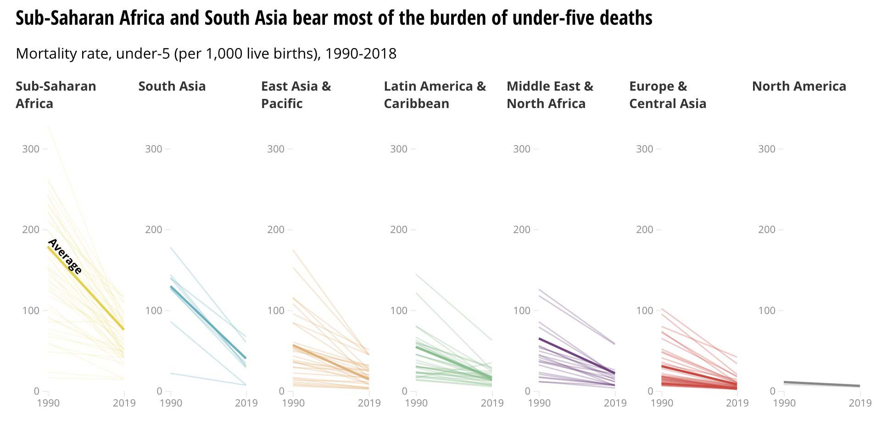
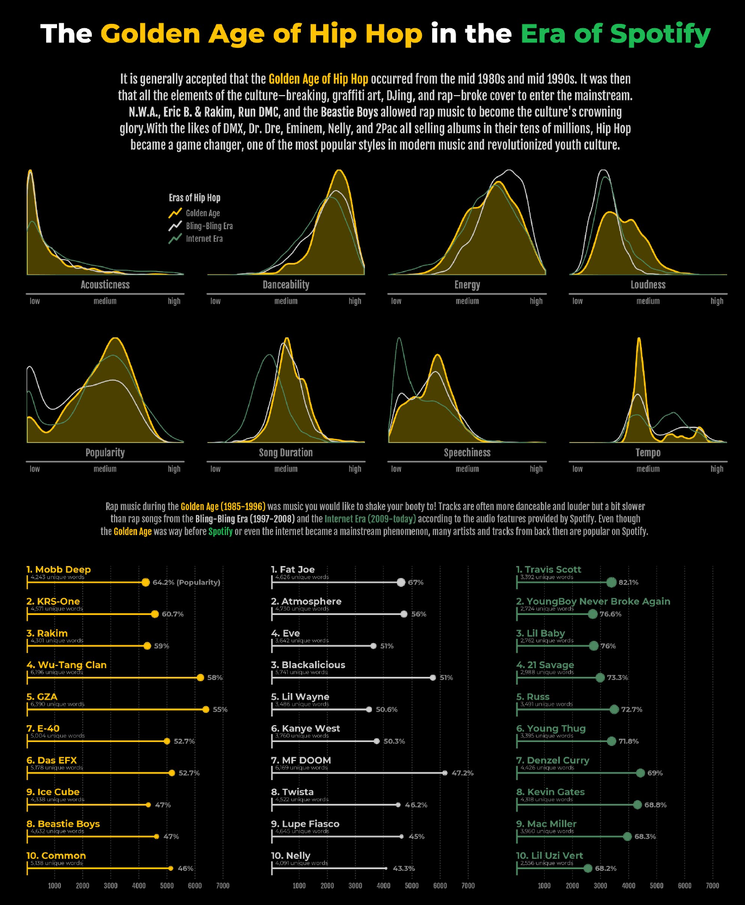
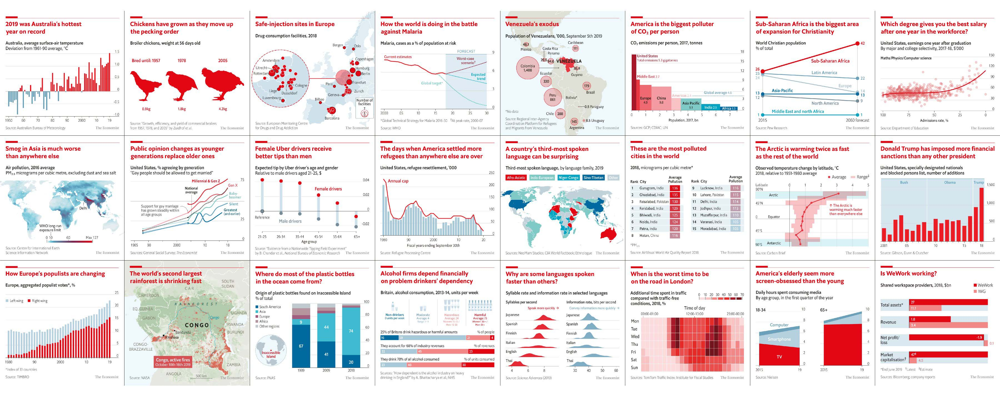

layout: true

<div class="my-footer"><span></span></div> 

---

# Learning objectives

**About today:**

- Introduction to [**ggplot2**](https://ggplot2.tidyverse.org/index.html) and basic of grammar of graphics
- Best practices and use of [**unhcr_theme**](https://github.com/UNHCR-WEB/unhcRstyle)
- Basic of [**Rmarkdown**](https://bookdown.org/yihui/rmarkdown/) and use of the UNHCR report template

**Not today:**

- Data import: [readr](https://readr.tidyverse.org/), [readxl](), etc.
- Data manipulation: [dplyr](https://dplyr.tidyverse.org/), [tidyr](https://tidyr.tidyverse.org/), etc.
- R programming: [R for Data Science](https://r4ds.had.co.nz/), [Advanced R Programming](https://adv-r.hadley.nz/), etc.

---
class: center, middle, inverse

# Ggplot2

### The grammar of graphics

---

## Grammar of graphic

- A book of Leland Wilkinson in 1999
- A theoretical **deconstruction of data graphics**
- Foundation for many graphic applications such as ggplot and Tableau

## The idea

- Not to start with the final form of the graphic
- What does it take to create a graphic?
- **Decompose graphics** into its constituents

---
class: center

.img75[]

[@CedSherer](https://twitter.com/CedScherer/status/1229418108122783744?s=20)

???
**Data**
- Data is not just data
- Representation defines what can be done with it
- Grammar requires a tidy format (though it precedes the notion) 

**Aesthetics**
- Allow generic datasets to be understood by the graphic system.
- Link variables in data to graphical properties in the geometry.

**Layers**
1. Geom
    - How to interpret aesthetics as graphical representations
    - Is a progression of positional aesthetics a number of points, a line, a single polygon, or something else entirely?
2. Stats
    - Transform input variables to displayed values
    - Is implicit in many plot-types but can often be done prior to plotting

**Scales**
- A scale translate back and forth between variable ranges and property ranges
    - Categories > Colour
    - Numbers > Position

**Coordinates**
- Defines the physical mapping of the aesthetics to the paper 

**Facets**
- Define the number of panels with equal logic and split data among them…
- Small multiples 

**Themes**
- Theming spans every part of the graphic that is not linked to data

---

## Structure of ggplot in action

```{r load, comment='#', include=FALSE}
library(tidyverse)
library(unhcrdatapackage)
library(unhcRstyle)
library(readxl)
popdata <- unhcrdatapackage::end_year_population_totals
data_4W <- read_excel("4W_Publico_Consolidado_septiembre.xlsx")
data_4W %>%
  mutate(Municipio = str_to_lower(Municipio),
         Municipio = str_replace_all(Municipio, "á", "a"),
         Municipio = str_replace_all(Municipio, "í", "i"),
         Municipio = str_replace_all(Municipio, "ó", "o"),
         Municipio = str_replace_all(Municipio, "é", "e"),
         Municipio = str_replace_all(Municipio, "ú", "u")) %>%
  distinct(Municipio)

data_4W %>%
  mutate(Departamento = str_to_lower(Departamento)) %>%
  distinct(Departamento)

length(union(data_4W$`Socio principal`, data_4W$`Socio implementador`))

data_4W %>%
  filter(Estado == "Completada") %>%
  summarise(sum(Cantidad, na.rm = TRUE))

data_4W %>%
  filter(Estado == "Completada") %>%
  summarise(sum(`Beneficiarios mensuales`, na.rm = TRUE))

data_4W_comunicacion <- data_4W %>%
  filter(Sector == "Comunicación")
union(data_4W_comunicacion$`Socio principal`, data_4W_comunicacion$`Socio implementador`)
```

```{r struct-ggplot-data, comment='#', include=FALSE}
ref_idp_year <- popdata %>% 
  dplyr::filter(Year >= 2010) %>% 
  dplyr::group_by(Year) %>% 
  dplyr::summarise(Refugees = sum(REF, na.rm = TRUE),
                   IDPs = sum(IDP, na.rm = TRUE)) %>% 
  tidyr::pivot_longer(cols = c("Refugees", "IDPs"), names_to = "Population type", values_to = "Number of people") %>% 
  dplyr::mutate(`Number of people (in million)` = round(`Number of people`/1000000, digits = 1))
```

We will try to cover the different aspect of the ggplot structure with one simple plot representing the cumulative number of Refugees and IDPs from 2010 to 2019.

.pull-left[

**Packages**

```{r, eval=FALSE}
library(tidyverse)
library(unhcrdatapackage)
```

]

.pull-right[

**Sample of the data**

```{r, echo=FALSE}
knitr::kable(head(ref_idp_year), format = 'html')
```

]

---

.pull-left[

```{r, eval=FALSE, comment='#'}
ggplot(data = ref_idp_year) #<<
```

]

.pull-right[

```{r struct-step1, echo=FALSE, dev='svglite'}
ggplot(data = ref_idp_year)
```

]

---

.pull-left[

```{r, eval=FALSE, comment='#'}
ggplot(data = ref_idp_year) +
  aes(x = Year, #<<
      y = `Number of people (in million)`) #<<
```

]

.pull-right[

```{r struct-step2, echo=FALSE, dev='svglite'}
ggplot(data = ref_idp_year) +
  aes(x = Year,
      y = `Number of people (in million)`)
```

]

---

.pull-left[

```{r, eval=FALSE, comment='#'}
ggplot(data = ref_idp_year) +
  aes(x = Year,
      y = `Number of people (in million)`) +
  geom_point() #<<
```

]

.pull-right[

```{r struct-step3, echo=FALSE, dev='svglite'}
ggplot(data = ref_idp_year) +
  aes(x = Year,
      y = `Number of people (in million)`) +
  geom_point()
```

]

---

.pull-left[

```{r, eval=FALSE, comment='#'}
ggplot(data = ref_idp_year) +
  aes(x = Year,
      y = `Number of people (in million)`) +
  geom_point() +
  aes(color = fct_rev(`Population type`)) #<<
```

]

.pull-right[

```{r struct-step4, echo=FALSE, dev='svglite'}
ggplot(data = ref_idp_year) +
  aes(x = Year,
      y = `Number of people (in million)`) +
  geom_point() +
  aes(color = fct_rev(`Population type`))
```

]

---

.pull-left[

```{r, eval=FALSE, comment='#'}
ggplot(data = ref_idp_year) +
  aes(x = Year,
      y = `Number of people (in million)`) +
  geom_point() +
  aes(color = fct_rev(`Population type`)) +
  scale_color_manual(values = c("#0072bc", "#00b398")) #<<
```

]

.pull-right[

```{r struct-step5, echo=FALSE, dev='svglite'}
ggplot(data = ref_idp_year) +
  aes(x = Year,
      y = `Number of people (in million)`) +
  geom_point() +
  aes(color = fct_rev(`Population type`)) +
  scale_color_manual(values = c("#0072bc", "#00b398"))
```

]

---

.pull-left[

```{r, eval=FALSE, comment='#'}
ggplot(data = ref_idp_year) +
  aes(x = Year,
      y = `Number of people (in million)`) +
  geom_point() +
  aes(color = fct_rev(`Population type`)) +
  scale_color_manual(values = c("#0072bc", "#00b398")) +
  coord_cartesian(ylim = c(0, 50)) #<<
```

]

.pull-right[

```{r struct-step6, echo=FALSE, dev='svglite'}
ggplot(data = ref_idp_year) +
  aes(x = Year,
      y = `Number of people (in million)`) +
  geom_point() +
  aes(color = fct_rev(`Population type`)) +
  scale_color_manual(values = c("#0072bc", "#00b398")) +
  coord_cartesian(ylim = c(0, 50))
```

]

---

.pull-left[

```{r, eval=FALSE, comment='#'}
ggplot(data = ref_idp_year) +
  aes(x = Year,
      y = `Number of people (in million)`) +
  geom_point() +
  aes(color = fct_rev(`Population type`)) +
  scale_color_manual(values = c("#0072bc", "#00b398")) +
  coord_cartesian(ylim = c(0, 50)) +
  labs(title = "Number of refugees and IDPs around the world", #<<
       subtitle = "Evolution of the total population of refugees ad IDPs from 2010 to 2019", #<<
       caption = "Source: UNHCR Data Finder", #<<
       color = NULL) #<<
```

]

.pull-right[

```{r struct-step7, echo=FALSE, dev='svglite'}
ggplot(data = ref_idp_year) +
  aes(x = Year,
      y = `Number of people (in million)`) +
  geom_point() +
  aes(color = fct_rev(`Population type`)) +
  scale_color_manual(values = c("#0072bc", "#00b398")) +
  coord_cartesian(ylim = c(0, 50)) +
  labs(title = "Number of refugees and IDPs around the world",
       subtitle = "Evolution of the total population of refugees ad IDPs from 2010 to 2019",
       caption = "Source: UNHCR Data Finder",
       color = NULL)
```

]

---

.pull-left[

```{r, eval=FALSE, comment='#'}
ggplot(data = ref_idp_year) +
  aes(x = Year,
      y = `Number of people (in million)`) +
  geom_point() +
  aes(color = fct_rev(`Population type`)) +
  scale_color_manual(values = c("#0072bc", "#00b398")) +
  coord_cartesian(ylim = c(0, 50)) +
  labs(title = "Number of refugees and IDPs around the world",
       subtitle = "Evolution of the total population of refugees ad IDPs from 2010 to 2019",
       caption = "Source: UNHCR Data Finder",
       color = NULL) +
  theme_minimal() + #<<
  theme(legend.position = "top") #<<
```

]

.pull-right[

```{r struct-step8, echo=FALSE, dev='svglite'}
ggplot(data = ref_idp_year) +
  aes(x = Year,
      y = `Number of people (in million)`) +
  geom_point() +
  aes(color = fct_rev(`Population type`)) +
  scale_color_manual(values = c("#0072bc", "#00b398")) +
  coord_cartesian(ylim = c(0, 50)) +
  labs(title = "Number of refugees and IDPs around the world",
       subtitle = "Evolution of the total population of refugees ad IDPs from 2010 to 2019",
       caption = "Source: UNHCR Data Finder",
       color = NULL) +
  theme_minimal() +
  theme(legend.position = "top")
```

]

---


.pull-left[

**What if we want to add a line?**

```{r, eval=FALSE, comment='#'}
ggplot(data = ref_idp_year) +
  aes(x = Year,
      y = `Number of people (in million)`) +
  geom_point() +
  aes(color = fct_rev(`Population type`)) +
  geom_line() + # Is this correct? #<<
  scale_color_manual(values = c("#0072bc", "#00b398")) +
  coord_cartesian(ylim = c(0, 50)) +
  labs(title = "Number of refugees and IDPs around the world",
       subtitle = "Evolution of the total population of refugees ad IDPs from 2010 to 2019",
       caption = "Source: UNHCR Data Finder",
       color = NULL) +
  theme_minimal() +
  theme(legend.position = "top")
```

]

--

.pull-right[

```{r struct-step9, echo=FALSE, dev='svglite'}
ggplot(data = ref_idp_year) +
  aes(x = Year,
      y = `Number of people (in million)`) +
  geom_point() +
  aes(color = fct_rev(`Population type`)) +
  geom_line() +
  scale_color_manual(values = c("#0072bc", "#00b398")) +
  coord_cartesian(ylim = c(0, 50)) +
  labs(title = "Number of refugees and IDPs around the world",
       subtitle = "Evolution of the total population of refugees ad IDPs from 2010 to 2019",
       caption = "Source: UNHCR Data Finder",
       color = NULL) +
  theme_minimal() +
  theme(legend.position = "top")
```

]

---


.pull-left[

**What if we want to add a line?**

```{r, eval=FALSE, comment='#'}
ggplot(data = ref_idp_year) +
  aes(x = Year,
      y = `Number of people (in million)`) +
  geom_point() +
  aes(color = fct_rev(`Population type`)) +
  geom_line(aes(group = `Population type`)) +  #<<
  scale_color_manual(values = c("#0072bc", "#00b398")) +
  coord_cartesian(ylim = c(0, 50)) +
  labs(title = "Number of refugees and IDPs around the world",
       subtitle = "Evolution of the total population of refugees ad IDPs from 2010 to 2019",
       caption = "Source: UNHCR Data Finder",
       color = NULL) +
  theme_minimal() +
  theme(legend.position = "top")
```

]


.pull-right[

```{r struct-step10, echo=FALSE, dev='svglite'}
ggplot(data = ref_idp_year) +
  aes(x = Year,
      y = `Number of people (in million)`) +
  geom_point() +
  aes(color = fct_rev(`Population type`)) +
  geom_line(aes(group = `Population type`)) +
  scale_color_manual(values = c("#0072bc", "#00b398")) +
  coord_cartesian(ylim = c(0, 50)) +
  labs(title = "Number of refugees and IDPs around the world",
       subtitle = "Evolution of the total population of refugees ad IDPs from 2010 to 2019",
       caption = "Source: UNHCR Data Finder",
       color = NULL) +
  theme_minimal() +
  theme(legend.position = "top")
```

]

---
class: center, middle, inverse

#unhcRstyle

### Apply UNHCR brand to R created content

---

## Contents

1. Ggplot theme
2. Color palettes
3. Report templates

## Installation

```{r, eval=FALSE, comment='#'}
remotes::install_github('unhcr-web/unhcRstyle')
library(unhcRstyle)
```

---

```{r, include=FALSE, comment='#'}
ggplot_structure_ex <- ggplot(data = ref_idp_year) +
  aes(x = Year,
      y = `Number of people (in million)`) +
  geom_point() +
  aes(color = fct_rev(`Population type`)) +
  geom_line(aes(group = `Population type`)) +  
  scale_color_manual(values = c("#0072bc", "#00b398")) +
  coord_cartesian(ylim = c(0, 50)) +
  labs(title = "Number of refugees and IDPs around the world",
       subtitle = "Evolution of the total population of refugees ad IDPs from 2010 to 2019",
       caption = "Source: UNHCR Data Finder",
       color = NULL)
```


.pull-left[

## Ggplot theme

- Common UNHCR visual identity elements packed into one ggplot theme.

- Simply call .lead[`unhcr_theme()`] function within the flow of your plot creation code. 

- The function comes with a lot of customizable elements use .lead[`?unhcr_theme()`] to learn more about it

```{r, eval=FALSE, comment='#'}
ggplot_structure_ex +
  unhcr_theme() #<<
```

]

.pull-right[

```{r, echo=FALSE, comment='#', dev='ragg_png', dpi=300}
ggplot_structure_ex +
  unhcr_theme() #<<
```

]

---

.pull-left[

## Color palettes

- Definition of standard UNHCR color palettes (`unhcr_pal_primary`, `unhcr_pal_graphic`) as well as tints and shades (`unhcr_pal_blue`, `unhcr_pal_green`, etc.).

- Definition of simple name for main UNHCR colors (`unhcr_blue`, `unhcr_green`, etc.).

- 2 function to see and use the colors:
    - `seecol()`
    - `usecol()`


```{r, eval=FALSE, comment='#'}
seecol(pal = unhcr_pal_primary)
```

]

.pull-right[

```{r, echo=FALSE, comment='#', dev='ragg_png', dpi=300}
seecol(pal = unhcr_pal_primary)
```

]

---

.pull-left[

## Report templates

All based on Rmarkdown that allow to create multiple outputs from the same content format.

- Paginated report built on the top of pagedown.

- Analysis Repository contribution

- Word with UNHCR style

- Powerpoint with UNHCR style

- html/bootstrap -scroll-able report

- html/slide - slide-able report (WIP)


]

.pull-right[

Access them **"From Template"** panel when creating a new Rmd document


]

---
class: center, middle, inverse

# Demo/Exercises

### Let's practice

---

## Basics

1. All the plots  will be using the 2 following datasets:
    - **End-year population figures** from [unhcrdatapackage](https://github.com/unhcr/unhcrdatapackage)
    - **Colombia 4W** previously cleaned during basic R training
2. We will use an incremental technique to understand clearly the effect of each line of code on our plots
3. We won't spend time on the data manipulation part but we will present the structure of the dataset for each examples.
4. We will be using packages from [tidyverse](https://www.tidyverse.org/) and mainly [ggplot2](https://ggplot2.tidyverse.org/). If any other packages are needed for a specific plot, it will be clearly stated in the code.
5. For the UNHCR part, we will use the [unhcrdatapackage](https://github.com/unhcr/unhcrdatapackage) for data and the [unhcRstyle](https://github.com/UNHCR-WEB/unhcRstyle) package for all the visual aspect.

Make sure to install all the required packages before the exercises:

```{r install, comment='#', eval=FALSE}
install.packages('tidyverse')
remotes::install_github('unhcr/unhcrdatapackage')
remotes::install_github('unhcr-web/unhcRstyle')
```

---

## Bar chart

.pull-left[


Develop a bar chart of total international displacement (refugees, asylum-seekers and Venezuelans displaced abroad) from 2010 to 2019.

**The dataset:**

```{r, comment='#'}
int_displ <- popdata %>% 
  filter(Year >=2010) %>% 
  group_by(Year) %>% 
  summarise(Refugees = sum(REF, na.rm = TRUE),
            `Asylum-seekers` = sum(ASY, na.rm = TRUE),
            `Venezuelans displaced abroad` = sum(VDA, na.rm = TRUE)) %>% 
  pivot_longer(cols = c("Refugees", "Asylum-seekers", "Venezuelans displaced abroad"),
               values_to = "Number of displaced", names_to = "Population type")

```


]

.pull-right[

```{r, echo=FALSE}
knitr::kable(head(int_displ), format = 'html')
```

]

---

.pull-left[

**Step 1:** Add data, map to the aesthetic and add a geom

```{r, eval=FALSE, comment='#'}
ggplot(data = int_displ) +
  aes(x = Year, y=`Number of displaced`) +
  geom_col()
```


]

.pull-right[

```{r bar-step1, echo=FALSE, dev='ragg_png', dpi=300}
ggplot(data = int_displ) +
  aes(x = Year, y=`Number of displaced`) +
  geom_col()
```

]

---

.pull-left[

**Step 2:** Rotate the axis for easier comparison and apply unhcr_theme

```{r, eval=FALSE, comment='#'}
ggplot(data = int_displ) +
  aes(x = Year, y=`Number of displaced`) +
  geom_col() +
  coord_flip() + #<<
  unhcr_theme() #<<
```


]

.pull-right[

```{r bar-step2, echo=FALSE, dev='ragg_png', dpi=300}
ggplot(data = int_displ) +
  aes(x = Year, y=`Number of displaced`) +
  geom_col() +
  coord_flip() +
  unhcr_theme()
```

]

---

.pull-left[

**Step 3:** Add information about the graph and define active gridline in unhcr_theme

```{r, eval=FALSE, comment='#'}
ggplot(data = int_displ) +
  aes(x = Year, y=`Number of displaced`) +
  geom_col() +
  coord_flip() +
  unhcr_theme(grid = "Xx") + #Keeps major and minor X gridlines see unhcr_theme doc #<<
  labs(title = "Total number of international displacement", #<<
       subtitle = "Refugees, Asylum-seekers and Venezuelans displaced abroad from 2010 to 2019", #<<
       caption = "Source: UNHCR Data Finder") #<<
```


]

.pull-right[

```{r bar-step3, echo=FALSE, dev='ragg_png', dpi=300}
ggplot(data = int_displ) +
  aes(x = Year, y=`Number of displaced`) +
  geom_col() +
  coord_flip() +
  unhcr_theme(grid = "Xx") +
  labs(title = "Total number of international displacement",
       subtitle = "Refugees, Asylum-seekers and Venezuelans displaced abroad from 2010 to 2019",
       caption = "Source: UNHCR Data Finder")
```

]

---

.pull-left[

**Step 4:** Change color of bars

```{r, eval=FALSE, comment='#'}
ggplot(data = int_displ) +
  aes(x = Year, y=`Number of displaced`) +
  geom_col(color = unhcr_blue) + #<<
  coord_flip() +
  unhcr_theme(grid = "Xx") +  
  labs(title = "Total number of international displacement",
       subtitle = "Refugees, Asylum-seekers and Venezuelans displaced abroad from 2010 to 2019", 
       caption = "Source: UNHCR Data Finder") 
```


]

--

.pull-right[

```{r bar-step4, echo=FALSE, dev='ragg_png', dpi=300}
ggplot(data = int_displ) +
  aes(x = Year, y=`Number of displaced`) +
  geom_col(color = unhcr_blue) +
  coord_flip() +
  unhcr_theme(grid = "Xx") +
  labs(title = "Total number of international displacement",
       subtitle = "Refugees, Asylum-seekers and Venezuelans displaced abroad from 2010 to 2019",
       caption = "Source: UNHCR Data Finder")
```

]

---

.pull-left[

**Step 4:** Change color of bars

```{r, eval=FALSE, comment='#'}
ggplot(data = int_displ) +
  aes(x = Year, y=`Number of displaced`) +
  geom_col(fill = unhcr_blue) + #<<
  coord_flip() +
  unhcr_theme(grid = "Xx") +  
  labs(title = "Total number of international displacement",
       subtitle = "Refugees, Asylum-seekers and Venezuelans displaced abroad from 2010 to 2019", 
       caption = "Source: UNHCR Data Finder") 
```


]


.pull-right[

```{r bar-step4-1, echo=FALSE, dev='ragg_png', dpi=300}
ggplot(data = int_displ) +
  aes(x = Year, y=`Number of displaced`) +
  geom_col(fill = unhcr_blue) +
  coord_flip() +
  unhcr_theme(grid = "Xx") +
  labs(title = "Total number of international displacement",
       subtitle = "Refugees, Asylum-seekers and Venezuelans displaced abroad from 2010 to 2019",
       caption = "Source: UNHCR Data Finder")
```

]

---

.pull-left[

**Step 5:** Clean subtitle and improve axis labeling and limits

```{r, eval=FALSE, comment='#'}
library(scales) #<<
ggplot(data = int_displ) +
  aes(x = Year, y=`Number of displaced`) +
  geom_col(fill = unhcr_blue) +
  coord_flip() +
  unhcr_theme(grid = "Xx") +
  labs(title = "Total number of international displacement",
       subtitle = "Refugees, Asylum-seekers and Venezuelans displaced abroad\nfrom 2010 to 2019",
       caption = "Source: UNHCR Data Finder",
       x = "") + #<<
  scale_y_continuous(labels = scales::label_number_si(), #<<
                     limits = c(NA, 30000000)) #<<
```


]

.pull-right[

```{r bar-step5, echo=FALSE, dev='ragg_png', dpi=300}
library(scales)
ggplot(data = int_displ) +
  aes(x = Year, y=`Number of displaced`) +
  geom_col(fill = unhcr_blue) +
  coord_flip() +
  unhcr_theme(grid = "Xx") +
  labs(title = "Total number of international displacement",
       subtitle = "Refugees, Asylum-seekers and Venezuelans displaced abroad\nfrom 2010 to 2019",
       caption = "Source: UNHCR Data Finder",
       x = "") +
  scale_y_continuous(labels = scales::label_number_si(),
                     limits = c(NA, 30000000))
```

]

---

**What if I want to show the different population type?**

--

.pull-left[

```{r, eval=FALSE, comment='#'}
ggplot(data = int_displ) +
  aes(x = Year, y=`Number of displaced`) +
  geom_col(aes(fill = `Population type`)) + #<<
  coord_flip() +
  unhcr_theme(grid = "Xx") +
  labs(title = "Total number of international displacement",
       subtitle = "Refugees, Asylum-seekers and Venezuelans displaced abroad\nfrom 2010 to 2019",
       caption = "Source: UNHCR Data Finder",
       x = "") +
  scale_y_continuous(labels = scales::label_number_si(),
                     limits = c(NA, 30000000))
```


]

.pull-right[

```{r bar-step6, echo=FALSE, dev='ragg_png', dpi=300}
ggplot(data = int_displ) +
  aes(x = Year, y=`Number of displaced`) +
  geom_col(aes(fill = `Population type`)) +
  coord_flip() +
  unhcr_theme(grid = "Xx") +
  labs(title = "Total number of international displacement",
       subtitle = "Refugees, Asylum-seekers and Venezuelans displaced abroad\nfrom 2010 to 2019",
       caption = "Source: UNHCR Data Finder",
       x = "") +
  scale_y_continuous(labels = scales::label_number_si(),
                     limits = c(NA, 30000000))
```

]

---

.pull-left[

Apply UNHCR colors and reorder classes to be more easily comparable

```{r, eval=FALSE, comment='#'}
ggplot(data = int_displ) +
  aes(x = Year, y=`Number of displaced`) +
  geom_col(aes(fill = factor(`Population type`, #<<
                             levels = c("Venezuelans displaced abroad", "Asylum-seekers", "Refugees")))) + #<<
  coord_flip() +
  unhcr_theme(grid = "Xx") +
  labs(title = "Total number of international displacement",
       subtitle = "Refugees, Asylum-seekers and Venezuelans displaced abroad\nfrom 2010 to 2019",
       caption = "Source: UNHCR Data Finder",
       x = "") +
  scale_y_continuous(labels = scales::label_number_si(),
                     limits = c(NA, 30000000)) +
  scale_fill_manual(values = usecol(pal = c(unhcr_green, unhcr_darkblue, unhcr_blue))) #<<
```


]

.pull-right[

```{r bar-step7, echo=FALSE, dev='ragg_png', dpi=300}
ggplot(data = int_displ) +
  aes(x = Year, y=`Number of displaced`) +
  geom_col(aes(fill = factor(`Population type`,
                             levels = c("Venezuelans displaced abroad", "Asylum-seekers", "Refugees")))) +
  coord_flip() +
  unhcr_theme(grid = "Xx") +
  labs(title = "Total number of international displacement",
       subtitle = "Refugees, Asylum-seekers and Venezuelans displaced abroad\nfrom 2010 to 2019",
       caption = "Source: UNHCR Data Finder",
       x = "") +
  scale_y_continuous(labels = scales::label_number_si(),
                     limits = c(NA, 30000000)) +
  scale_fill_manual(values = usecol(pal = c(unhcr_green, unhcr_darkblue, unhcr_blue)))
```

]

---
class: center, middle

# Your turn

### Go to workshop_plot_exercise.Rmd and let's work on Exercise 1
### The file also includes results

---

## Line chart

.pull-left[


Develop a line chart of total refugees from 2000 to 2019.

**The dataset:**

```{r, comment='#'}
evo_disp <- popdata %>% 
  filter(Year >=2000) %>% 
  group_by(Year) %>% 
  summarise(Refugees = sum(REF, na.rm = TRUE),
            `IDPs` = sum(IDP, na.rm = TRUE),
            `Asylum-seekers` = sum(ASY, na.rm = TRUE),
            `Stateless` = sum(STA, na.rm = TRUE),
            `Other of concern` = sum(OOC, na.rm = TRUE),
            `Venezuelans displaced abroad` = sum(VDA, na.rm = TRUE))
```


]

.pull-right[

```{r, echo=FALSE}
knitr::kable(head(evo_disp), format = 'html')
```

]

---


.pull-left[

**Step 1:** Add data, map to the aesthetic and add a geom

```{r, eval=FALSE, comment='#'}
ggplot(data = evo_disp) +
  aes(x = Year, y=Refugees, group = 1) + # Important add the grouping #<<
  geom_line()
```


]

.pull-right[

```{r line-step1, echo=FALSE, dev='ragg_png', dpi=300}
ggplot(data = evo_disp) +
  aes(x = Year, y=Refugees, group = 1) +
  geom_line()
```

]

---

.pull-left[

**Step 2:** Apply unhcr_theme, color the line and add title

```{r, eval=FALSE, comment='#'}
ggplot(data = evo_disp) +
  aes(x = Year, y=Refugees, group = 1) +
  geom_line(color = unhcr_blue, size = 1) + #<<
  unhcr_theme() + #<<
  labs(title = "Total number of refugees",
       subtitle = "Evolution of refugee population 2000-2019",
       caption = "Source: UNHCR Data Finder")
```


]

.pull-right[

```{r line-step2, echo=FALSE, dev='ragg_png', dpi=300}
ggplot(data = evo_disp) +
  aes(x = Year, y=Refugees, group = 1) +
  geom_line(color = unhcr_blue, size = 1) +
  unhcr_theme() +
  labs(title = "Total number of refugees",
       subtitle = "Evolution of refugee population 2000-2019",
       caption = "Source: UNHCR Data Finder")
```

]

---

.pull-left[

**Step 3:** Clean axis

```{r, eval=FALSE, comment='#'}
library(scales)
ggplot(data = evo_disp) +
  aes(x = Year, y=Refugees, group = 1) +
  geom_line(color = unhcr_blue, size = 1) +
  unhcr_theme(grid = "Yy") +
  labs(title = "Total number of refugees",
       subtitle = "Evolution of refugee population 2000-2019",
       caption = "Source: UNHCR Data Finder") +
  scale_y_continuous(labels = scales::label_number_si(), #<<
                     name = "Number of refugees", #<<
                     limits = c(5000000, 25000000)) + #<<
  scale_x_discrete(breaks = c(2000,2005, 2010, 2015, 2019), name = "") #<<
```


]

.pull-right[

```{r line-step3, echo=FALSE, dev='ragg_png', dpi=300}
ggplot(data = evo_disp) +
  aes(x = Year, y=Refugees, group = 1) +
  geom_line(color = unhcr_blue, size = 1) +
  unhcr_theme(grid = "Yy") +
  labs(title = "Total number of refugees",
       subtitle = "Evolution of refugee population 2000-2019",
       caption = "Source: UNHCR Data Finder") +
  scale_y_continuous(labels = scales::label_number_si(),
                     name = "Number of refugees",
                     limits = c(5000000, 25000000)) +
  scale_x_discrete(breaks = c(2000,2005, 2010, 2015, 2019), name = "")
```

]

---

**What if I want to add a line for IDP?**

--

Need to rework the data before because with this structure I can't add any variable to the color. In ggplot data needs to be **tidy**. 

--

.pull-left[


```{r, comment='#'}
evo_disp_tidy <- evo_disp  %>% 
  pivot_longer(cols = c("Refugees",
                        "IDPs"),
               values_to = "Number of displaced", names_to = "Population type")
```


]

.pull-right[

```{r , echo=FALSE}
knitr::kable(head(evo_disp_tidy), format = 'html')
```

]

---

.pull-left[


```{r, eval=FALSE, comment='#'}
ggplot(data = evo_disp_tidy) +
  aes(x = Year, y= `Number of displaced`, color = `Population type`, group = `Population type`) +
  geom_line(size = 1) +
  unhcr_theme(grid = "Yy") +
  labs(title = "Total of displacment by population type",
       subtitle = "Evolution of displaced population 2000-2019",
       caption = "Source: UNHCR Data Finder") +
  scale_y_continuous(labels = scales::label_number_si(), 
                     name = "Number of person",
                     limits = c(0, 50000000)) + 
  scale_x_discrete(breaks = c(2000,2005, 2010, 2015, 2019), name = "") +
  scale_color_manual(values = usecol(pal = c(unhcr_green, unhcr_blue)))
```


]

.pull-right[

```{r line-step4, echo=FALSE, dev='ragg_png', dpi=300}
ggplot(data = evo_disp_tidy) +
  aes(x = Year, y= `Number of displaced`, color = `Population type`, group = `Population type`) +
  geom_line(size = 1) +
  unhcr_theme(grid = "Yy") +
  labs(title = "Total of displacment by population type",
       subtitle = "Evolution of displaced population 2000-2019",
       caption = "Source: UNHCR Data Finder") +
  scale_y_continuous(labels = scales::label_number_si(), 
                     name = "Number of person",
                     limits = c(0, 50000000)) + 
  scale_x_discrete(breaks = c(2000,2005, 2010, 2015, 2019), name = "") +
  scale_color_manual(values = usecol(pal = c(unhcr_green, unhcr_blue)))
```

]

---
class: center, middle

# Your turn

### Go to workshop_plot_exercise.Rmd and let's work on Exercise 2
### The file also includes results

---

## Pie chart

.pull-left[


Develop a pie chart of the proportion of the refugee population against the total displaced population in 2019.

**The dataset:**

```{r, comment='#'}
total_refugee <- popdata %>% 
  filter(Year == 2019) %>% 
  group_by(Year) %>% 
  summarise(value = sum(REF, na.rm = TRUE)) %>% 
  mutate(type = "Refugees")

total_other <- popdata %>% 
  filter(Year ==2019) %>% 
  group_by(Year) %>% 
  summarise(value = sum(IDP, VDA, ASY, STA, OOC, na.rm = TRUE)) %>% 
  mutate(type = "All of displaced")

pie_df <- rbind(total_refugee, total_other)

```


]

.pull-right[

```{r, echo=FALSE}
knitr::kable(head(pie_df), format = 'html')
```

]

---
class: middle

**Step 1:** Add data, map to the aesthetic and add a geom

.pull-left[


```{r, eval=FALSE, comment='#'}
ggplot(data = evo_disp) +
  aes(x = value, fill = type) +
  geom_pie() #<<
```

### geom_pie doesn't exist but what is a pie chart??

]

--

.pull-right[

### It's simply a 100% stacked bar chart that has been rotated.

### This is where the coordinates of ggplot become handy

]

---

**Step 1:** Add data, map to the aesthetic and add a geom

.pull-left[


```{r, eval=FALSE, comment='#'}
ggplot(data = pie_df) +
  aes(x = "", y = value, fill = type) + #<<
  geom_bar(stat = "identity", width = 1) #<<
```


]

.pull-right[

```{r pie-step1, echo=FALSE, dev='ragg_png', dpi=300}
ggplot(data = pie_df) +
  aes(x = "", y = value, fill = type) + #<<
  geom_bar(stat = "identity", width = 1) #<<
```

]

---

**Step 2:** Change coordinate system to polar

.pull-left[


```{r, eval=FALSE, comment='#'}
ggplot(data = pie_df) +
  aes(x = "", y = value, fill = type) + 
  geom_bar(stat = "identity", width = 1) +
  coord_polar("y", start=0) #<<
```


]

.pull-right[

```{r pie-step2, echo=FALSE, dev='ragg_png', dpi=300}
ggplot(data = pie_df) +
  aes(x = "", y = value, fill = type) + 
  geom_bar(stat = "identity", width = 1) +
  coord_polar("y", start=0)
```

]

---

**Step 3:** Improve appearance

.pull-left[


```{r, eval=FALSE, comment='#'}
ggplot(data = pie_df) +
  aes(x = "", y = value, fill = type) + 
  geom_bar(stat = "identity", width = 1) +
  coord_polar("y", start=0) +
  theme_void() + #<<
  scale_fill_manual(values = usecol(c(unhcr_pal_grey[2], unhcr_blue)))
```


]

.pull-right[

```{r pie-step3, echo=FALSE, dev='ragg_png', dpi=300}
ggplot(data = pie_df) +
  aes(x = "", y = value, fill = type) + 
  geom_bar(stat = "identity", width = 1) +
  coord_polar("y", start=0) +
  theme_void() +
  scale_fill_manual(values = usecol(c(unhcr_pal_grey[2], unhcr_blue)))
```

]

---

**Step 4:** Labeling

.pull-left[

This can be tricky so please see below the example

```{r, eval=FALSE, comment='#'}
# Compute the position of labels
pie_df2 <- pie_df %>%
  mutate(prop = value / sum(pie_df$value) *100) %>% # Calculate proportion #<<
  mutate(ypos = cumsum(prop)- 0.5*prop ) # Calculate position based on proportion #<<

# Apply to the pie chart
ggplot(data = pie_df2) +
  aes(x = "", y = prop, fill = type) + 
  geom_bar(stat = "identity", width = 1) +
  coord_polar("y", start=0) +
  theme_void() +
  theme(legend.position="none") +
  scale_fill_manual(values = usecol(c(unhcr_pal_grey[2], unhcr_pal_blue[3]))) +
  geom_text(aes(y = ypos, label = paste0(type, ": ", round(prop, digits = 1), "%" ), size = 6)) #<<
```


]

.pull-right[

```{r pie-step4, echo=FALSE, dev='ragg_png', dpi=300}
# Compute the position of labels
pie_df2 <- pie_df %>%
  mutate(prop = value / sum(pie_df$value) *100) %>% # Calculate proportion
  mutate(ypos = cumsum(prop)- 0.5*prop ) # Calculate position based on proportion

# Apply to the pie chart
ggplot(data = pie_df2) +
  aes(x = "", y = prop, fill = type) + 
  geom_bar(stat = "identity", width = 1) +
  coord_polar("y", start=0) +
  theme_void() +
  theme(legend.position="none") +
  scale_fill_manual(values = usecol(c(unhcr_pal_grey[2], unhcr_pal_blue[3]))) +
  geom_text(aes(y = ypos, label = paste0(type, ": ", round(prop, digits = 1), "%" ), size = 6))
```

]

---
class: center, middle

# Your turn

### Go to workshop_plot_exercise.Rmd and let's work on Exercise 3
### The file also includes results

---

## Interesting packages for ggplot

- Patchwork to bind multiple plots on one

- Gganimate to create simple animation

- Ggtext and ggrepel to deal with annotation and text style

- Ggforce to group some content visually

- and much more.... just go out there and experiment

---

## Examples

.center[

.img75[]

[@maartenzam](https://twitter.com/maartenzam)
]

---

.center[

.img50[]

[@CedSherer](https://twitter.com/CedScherer)
]

---
class: middle, center

.img75[]

[@Jake_Lawlor1](https://twitter.com/Jake_Lawlor1)

---
class: center, middle, inverse

# UNHCR Paged Report

### Demo of the use of paginated html report.

### Go to report folder for some examples and documentation

---

## Resources

### Ggplot:

- [Ggplot main doc](https://ggplot2.tidyverse.org/index.html)
- [The ggplot flipbook](https://evamaerey.github.io/ggplot_flipbook/ggplot_flipbook_xaringan.html#1) by Gina Reynolds
- [A ggplot2 tutorial for beautiful plotting in R](https://www.cedricscherer.com/2019/08/05/a-ggplot2-tutorial-for-beautiful-plotting-in-r/) and [ggplot Wizardry Hands-On](https://z3tt.github.io/OutlierConf2021/) by Cedric Scherer
- Ggplot workshop [Part1](https://www.youtube.com/watch?v=h29g21z0a68)/[Part2](https://www.youtube.com/watch?v=0m4yywqNPVY) by Thomas Lin Pedersen (one of the main maintainer of ggplot)

### Rmarkdown:

- [Rstudio introduction to Rmd](https://rmarkdown.rstudio.com/lesson-1.html)
- [R Markdown: The Definitive Guide](https://bookdown.org/yihui/rmarkdown/) by Yihui Xie, J.J. Allaire, Garrett Grolemund

---
class: center, middle, inverse

# Thank you

### Good luck in your R journey
