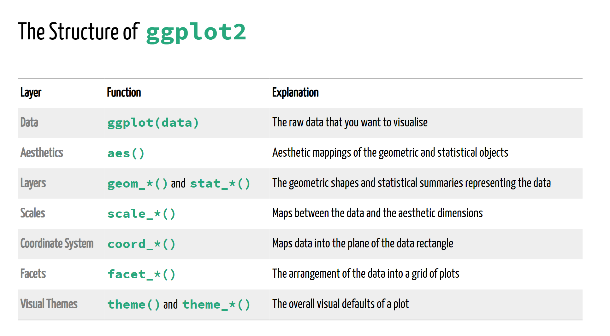
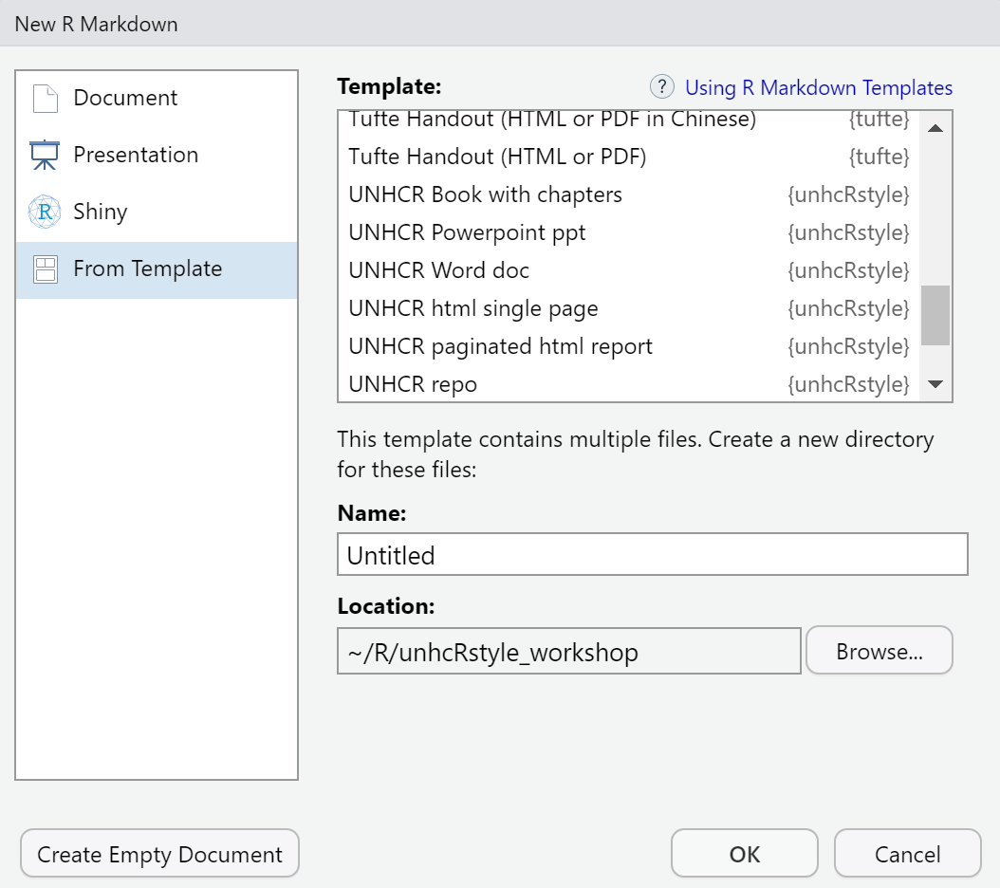
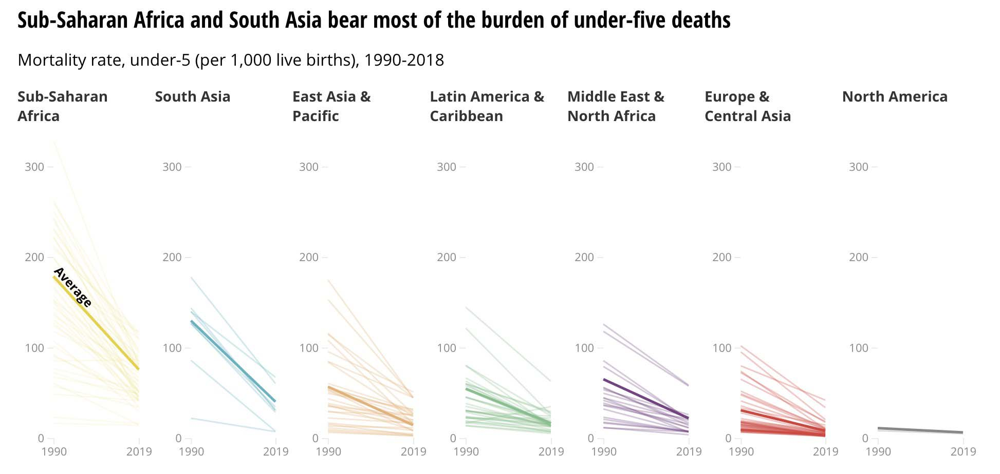
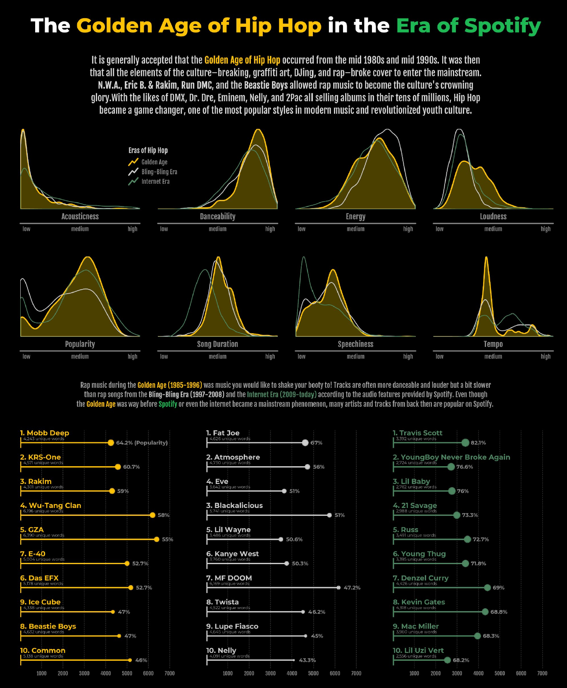

layout: true

<div class="my-footer"><span></span></div> 

---

# Objetivos de aprendizaje

**Sobre el día de hoy:**

- Introducción  a  [**ggplot2**](https://ggplot2.tidyverse.org/index.html) y a la gramática básica de los gráficos
- Mejores prácticas y uso de  [**unhcr_theme**](https://github.com/UNHCR-WEB/unhcRstyle)
- Fundamentos de  [**Rmarkdown**](https://bookdown.org/yihui/rmarkdown/) ay uso de la plantilla de informe del ACNUR

**Hoy no:**

- Importación de dato: [readr](https://readr.tidyverse.org/), [readxl](), etc.
- Manipulación de datos: [dplyr](https://dplyr.tidyverse.org/), [tidyr](https://tidyr.tidyverse.org/), etc.
- Programación en R: [R for Data Science](https://r4ds.had.co.nz/), [Advanced R Programming](https://adv-r.hadley.nz/), etc.

---
class: center, middle, inverse

# Ggplot2

### La gramática de los gráficos

---

## La gramática del gráfico

- Un libro de Leland Wilkinson en 1999
- Una **deconstrucción teórica de los gráficos de datos**
- Foundation for many graphic applications such as ggplot and Tableau


## La idea

- No empezar con la forma final de la gráfica
- Qué se necesita para crear una gráfica?
- **Descomponer los gráficos** en sus componentes


---
class: center

.img75[]

[@CedSherer](https://twitter.com/CedScherer/status/1229418108122783744?s=20)

???
**Datos**
- Los datos no son solo datos
- La representación define lo que se puede hacer con ellos
- La gramática require un formato ordenado (aunque precede a la noción) 


**Estética**
- Permitir que los conjuntos de datos genéricos sean comprendidos por el sistema gráfico.
- Vincular las variables de los datos a las propiedades gráficas de la geometría.


**Capas**
1. Geom
    - Cómo interpretar la estética como representaciones gráficas
    - Una progresión de la estética posicional es un número de puntos, una línea, un solo polígono o algo totalmente distinto? 
2. Estadísticas 
- Transformar las variables de entrada en valores mostrados
    - Está implícito en muchos tipos de gráficos, pero a menudo puede hacerse antes de trazarlos


**Scales**
- A scale translate back and forth between variable ranges and property ranges
    - Categories > Colour
    - Numbers > Position

**Escalas**
- Una escala traduce hacia adelante y hacia atrás entre rangos de variables y rangos de propiedades   

**Facetas**
- Define el número de paneles con igual lógica y reparte los datos entre ellos...
- Múltiplos pequeños


**Temas**
- La tematización abarca todas las partes del gráfico que no están vinculadas a los datos

---

## Estructura de ggplot en acción

```{r load, comment='#', include=FALSE}
library(tidyverse)
library(unhcrdatapackage)
library(unhcRstyle)
library(readxl)
popdata <- unhcrdatapackage::end_year_population_totals
data_4W <- read_excel("4W_Publico_Consolidado_septiembre.xlsx")
data_4W %>%
  mutate(Municipio = str_to_lower(Municipio),
         Municipio = str_replace_all(Municipio, "á", "a"),
         Municipio = str_replace_all(Municipio, "í", "i"),
         Municipio = str_replace_all(Municipio, "ó", "o"),
         Municipio = str_replace_all(Municipio, "é", "e"),
         Municipio = str_replace_all(Municipio, "ú", "u")) %>%
  distinct(Municipio)

data_4W %>%
  mutate(Departamento = str_to_lower(Departamento)) %>%
  distinct(Departamento)

length(union(data_4W$`Socio principal`, data_4W$`Socio implementador`))

data_4W %>%
  filter(Estado == "Completada") %>%
  summarise(sum(Cantidad, na.rm = TRUE))

data_4W %>%
  filter(Estado == "Completada") %>%
  summarise(sum(`Beneficiarios mensuales`, na.rm = TRUE))

data_4W_comunicacion <- data_4W %>%
  filter(Sector == "Comunicación")
union(data_4W_comunicacion$`Socio principal`, data_4W_comunicacion$`Socio implementador`)
```

```{r struct-ggplot-data, comment='#', include=FALSE}
ref_idp_year <- popdata %>% 
  dplyr::filter(Year >= 2010) %>% 
  dplyr::group_by(Year) %>% 
  dplyr::summarise(Refugees = sum(REF, na.rm = TRUE),
                   IDPs = sum(IDP, na.rm = TRUE)) %>% 
  tidyr::pivot_longer(cols = c("Refugees", "IDPs"), names_to = "Population type", values_to = "Number of people") %>% 
  dplyr::mutate(`Number of people (in million)` = round(`Number of people`/1000000, digits = 1))
```

Intentaremos cubrir los diferentes aspectos de la estructura ggplot con un simple gráfico que represente el número acumulado de refugiados y desplazados internos desde 2010 hasta 2019.

.pull-left[

**Paquetes**

```{r, eval=FALSE}
library(tidyverse)
library(unhcrdatapackage)
```

]

.pull-right[

**Muestra de los datos**

```{r, echo=FALSE}
knitr::kable(head(ref_idp_year), format = 'html')
```

]

---

.pull-left[

```{r, eval=FALSE, comment='#'}
ggplot(data = ref_idp_year) #<<
```

]

.pull-right[

```{r struct-step1, echo=FALSE, dev='svglite'}
ggplot(data = ref_idp_year)
```

]

---

.pull-left[

```{r, eval=FALSE, comment='#'}
ggplot(data = ref_idp_year) +
  aes(x = Year, #<<
      y = `Number of people (in million)`) #<<
```

]

.pull-right[

```{r struct-step2, echo=FALSE, dev='svglite'}
ggplot(data = ref_idp_year) +
  aes(x = Year,
      y = `Number of people (in million)`)
```

]

---

.pull-left[

```{r, eval=FALSE, comment='#'}
ggplot(data = ref_idp_year) +
  aes(x = Year,
      y = `Number of people (in million)`) +
  geom_point() #<<
```

]

.pull-right[

```{r struct-step3, echo=FALSE, dev='svglite'}
ggplot(data = ref_idp_year) +
  aes(x = Year,
      y = `Number of people (in million)`) +
  geom_point()
```

]

---

.pull-left[

```{r, eval=FALSE, comment='#'}
ggplot(data = ref_idp_year) +
  aes(x = Year,
      y = `Number of people (in million)`) +
  geom_point() +
  aes(color = fct_rev(`Population type`)) #<<
```

]

.pull-right[

```{r struct-step4, echo=FALSE, dev='svglite'}
ggplot(data = ref_idp_year) +
  aes(x = Year,
      y = `Number of people (in million)`) +
  geom_point() +
  aes(color = fct_rev(`Population type`))
```

]

---

.pull-left[

```{r, eval=FALSE, comment='#'}
ggplot(data = ref_idp_year) +
  aes(x = Year,
      y = `Number of people (in million)`) +
  geom_point() +
  aes(color = fct_rev(`Population type`)) +
  scale_color_manual(values = c("#0072bc", "#00b398")) #<<
```

]

.pull-right[

```{r struct-step5, echo=FALSE, dev='svglite'}
ggplot(data = ref_idp_year) +
  aes(x = Year,
      y = `Number of people (in million)`) +
  geom_point() +
  aes(color = fct_rev(`Population type`)) +
  scale_color_manual(values = c("#0072bc", "#00b398"))
```

]

---

.pull-left[

```{r, eval=FALSE, comment='#'}
ggplot(data = ref_idp_year) +
  aes(x = Year,
      y = `Number of people (in million)`) +
  geom_point() +
  aes(color = fct_rev(`Population type`)) +
  scale_color_manual(values = c("#0072bc", "#00b398")) +
  coord_cartesian(ylim = c(0, 50)) #<<
```

]

.pull-right[

```{r struct-step6, echo=FALSE, dev='svglite'}
ggplot(data = ref_idp_year) +
  aes(x = Year,
      y = `Number of people (in million)`) +
  geom_point() +
  aes(color = fct_rev(`Population type`)) +
  scale_color_manual(values = c("#0072bc", "#00b398")) +
  coord_cartesian(ylim = c(0, 50))
```

]

---

.pull-left[

```{r, eval=FALSE, comment='#'}
ggplot(data = ref_idp_year) +
  aes(x = Year,
      y = `Number of people (in million)`) +
  geom_point() +
  aes(color = fct_rev(`Population type`)) +
  scale_color_manual(values = c("#0072bc", "#00b398")) +
  coord_cartesian(ylim = c(0, 50)) +
  labs(title = "Number of refugees and IDPs around the world", #<<
       subtitle = "Evolution of the total population of refugees ad IDPs from 2010 to 2019", #<<
       caption = "Source: UNHCR Data Finder", #<<
       color = NULL) #<<
```

]

.pull-right[

```{r struct-step7, echo=FALSE, dev='svglite'}
ggplot(data = ref_idp_year) +
  aes(x = Year,
      y = `Number of people (in million)`) +
  geom_point() +
  aes(color = fct_rev(`Population type`)) +
  scale_color_manual(values = c("#0072bc", "#00b398")) +
  coord_cartesian(ylim = c(0, 50)) +
  labs(title = "Number of refugees and IDPs around the world",
       subtitle = "Evolution of the total population of refugees ad IDPs from 2010 to 2019",
       caption = "Source: UNHCR Data Finder",
       color = NULL)
```

]

---

.pull-left[

```{r, eval=FALSE, comment='#'}
ggplot(data = ref_idp_year) +
  aes(x = Year,
      y = `Number of people (in million)`) +
  geom_point() +
  aes(color = fct_rev(`Population type`)) +
  scale_color_manual(values = c("#0072bc", "#00b398")) +
  coord_cartesian(ylim = c(0, 50)) +
  labs(title = "Number of refugees and IDPs around the world",
       subtitle = "Evolution of the total population of refugees ad IDPs from 2010 to 2019",
       caption = "Source: UNHCR Data Finder",
       color = NULL) +
  theme_minimal() + #<<
  theme(legend.position = "top") #<<
```

]

.pull-right[

```{r struct-step8, echo=FALSE, dev='svglite'}
ggplot(data = ref_idp_year) +
  aes(x = Year,
      y = `Number of people (in million)`) +
  geom_point() +
  aes(color = fct_rev(`Population type`)) +
  scale_color_manual(values = c("#0072bc", "#00b398")) +
  coord_cartesian(ylim = c(0, 50)) +
  labs(title = "Number of refugees and IDPs around the world",
       subtitle = "Evolution of the total population of refugees ad IDPs from 2010 to 2019",
       caption = "Source: UNHCR Data Finder",
       color = NULL) +
  theme_minimal() +
  theme(legend.position = "top")
```

]

---


.pull-left[

**Qué pasa si queremos añadir una línea?**

```{r, eval=FALSE, comment='#'}
ggplot(data = ref_idp_year) +
  aes(x = Year,
      y = `Number of people (in million)`) +
  geom_point() +
  aes(color = fct_rev(`Population type`)) +
  geom_line() + # Is this correct? #<<
  scale_color_manual(values = c("#0072bc", "#00b398")) +
  coord_cartesian(ylim = c(0, 50)) +
  labs(title = "Number of refugees and IDPs around the world",
       subtitle = "Evolution of the total population of refugees ad IDPs from 2010 to 2019",
       caption = "Source: UNHCR Data Finder",
       color = NULL) +
  theme_minimal() +
  theme(legend.position = "top")
```

]

--

.pull-right[

```{r struct-step9, echo=FALSE, dev='svglite'}
ggplot(data = ref_idp_year) +
  aes(x = Year,
      y = `Number of people (in million)`) +
  geom_point() +
  aes(color = fct_rev(`Population type`)) +
  geom_line() +
  scale_color_manual(values = c("#0072bc", "#00b398")) +
  coord_cartesian(ylim = c(0, 50)) +
  labs(title = "Number of refugees and IDPs around the world",
       subtitle = "Evolution of the total population of refugees ad IDPs from 2010 to 2019",
       caption = "Source: UNHCR Data Finder",
       color = NULL) +
  theme_minimal() +
  theme(legend.position = "top")
```

]

---


.pull-left[

**Qué pasa si queremos añadir una línea?**

```{r, eval=FALSE, comment='#'}
ggplot(data = ref_idp_year) +
  aes(x = Year,
      y = `Number of people (in million)`) +
  geom_point() +
  aes(color = fct_rev(`Population type`)) +
  geom_line(aes(group = `Population type`)) +  #<<
  scale_color_manual(values = c("#0072bc", "#00b398")) +
  coord_cartesian(ylim = c(0, 50)) +
  labs(title = "Number of refugees and IDPs around the world",
       subtitle = "Evolution of the total population of refugees ad IDPs from 2010 to 2019",
       caption = "Source: UNHCR Data Finder",
       color = NULL) +
  theme_minimal() +
  theme(legend.position = "top")
```

]


.pull-right[

```{r struct-step10, echo=FALSE, dev='svglite'}
ggplot(data = ref_idp_year) +
  aes(x = Year,
      y = `Number of people (in million)`) +
  geom_point() +
  aes(color = fct_rev(`Population type`)) +
  geom_line(aes(group = `Population type`)) +
  scale_color_manual(values = c("#0072bc", "#00b398")) +
  coord_cartesian(ylim = c(0, 50)) +
  labs(title = "Number of refugees and IDPs around the world",
       subtitle = "Evolution of the total population of refugees ad IDPs from 2010 to 2019",
       caption = "Source: UNHCR Data Finder",
       color = NULL) +
  theme_minimal() +
  theme(legend.position = "top")
```

]

---
class: center, middle, inverse

#unhcRstyle

### Aplicar la marca ACNUR al contenido creado en R

---

##  Contenido

1. Tema Ggplot 
2. Paleta de colores
3. Plantillas de reportes


## Instalación

```{r, eval=FALSE, comment='#'}
remotes::install_github('unhcr-web/unhcRstyle')
library(unhcRstyle)
```

---

```{r, include=FALSE, comment='#'}
ggplot_structure_ex <- ggplot(data = ref_idp_year) +
  aes(x = Year,
      y = `Number of people (in million)`) +
  geom_point() +
  aes(color = fct_rev(`Population type`)) +
  geom_line(aes(group = `Population type`)) +  
  scale_color_manual(values = c("#0072bc", "#00b398")) +
  coord_cartesian(ylim = c(0, 50)) +
  labs(title = "Number of refugees and IDPs around the world",
       subtitle = "Evolution of the total population of refugees ad IDPs from 2010 to 2019",
       caption = "Source: UNHCR Data Finder",
       color = NULL)
```


.pull-left[

## Tema Ggplot

- Elementos comunes de la identidad visual de ACNUR empaquetados en un tema ggplot.

- Simplemente llame a la función .lead[`unhcr_theme()`] dentro del flujo de su código de creación de gráficos. 

- La función viene con una gran cantidad de elementos personalizados use .lead[`?unhcr_theme()`] para saber más sobre ella

```{r, eval=FALSE, comment='#'}
ggplot_structure_ex +
  unhcr_theme() #<<
```

]

.pull-right[

```{r, echo=FALSE, comment='#', dev='ragg_png', dpi=300}
ggplot_structure_ex +
  unhcr_theme() #<<
```

]

---

.pull-left[

## Paleta de colores

- Definición de las paletas de colores estándar del ACNUR  (`unhcr_pal_primary`, `unhcr_pal_graphic`) Así como de las tintes y matices (`unhcr_pal_blue`, `unhcr_pal_green`, etc.).

- Definición de un nombre simple para los principales colores (`unhcr_blue`, `unhcr_green`, etc.).

- 2 funciones para ver y utilizar los colores:
    - `seecol()`
    - `usecol()`


```{r, eval=FALSE, comment='#'}
seecol(pal = unhcr_pal_primary)
```

]

.pull-right[

```{r, echo=FALSE, comment='#', dev='ragg_png', dpi=300}
seecol(pal = unhcr_pal_primary)
```

]

---

.pull-left[

## Plantillas de reportes 

Todas basadas en Rmarkdown que permiten crear múltiples salidas a partir del mismo formato de contenido.

- Informe paginado construido sobre el pagedown.

- Contribución al repositorio de análisis

- Word con estilo ACNUR

- Powerpoint con estilo ACNUR

- html/bootstrap -scroll-able report

- html/slide - slide-able report (WIP)


]

.pull-right[

Acceder a ellos **"Desde las plantilla"** panel al crear un nuevo documento Rmd



]

---
class: center, middle, inverse

# Demo/Exercises

### Vamos a practicar

---

## Básicos

1. Todos los gráficos utilizarán los dos conjuntos de datos siguientes:
    - **End-year population figures** from [unhcrdatapackage](https://github.com/unhcr/unhcrdatapackage)
    - **Colombia 4W** previamente limpiado durante el entrenamiento básico de R
2. Utilizaremos una técnica incremental para entender claramente el efecto de cada línea de código en nuestros gráficos
3. No dedicaremos tiempo a la parte de manipulación de los datos, pero presentaremos la estructura del conjunto de datos para cada uno de los ejemplos.
4. Utilizaremos paquetes de  [tidyverse](https://www.tidyverse.org/) y principalmente  [ggplot2](https://ggplot2.tidyverse.org/). Si se necesita algún otro paquete para un gráfico específico, se indicará claramente en el código.
5. Para la parte de ACNUR, utilizaremos el paquete de [unhcrdatapackage](https://github.com/unhcr/unhcrdatapackage) para los datos y el paquete de [unhcRstyle](https://github.com/UNHCR-WEB/unhcRstyle) para todo el aspecto visual.

Asegúrate de instalar todos los paquetes necesarios antes de realizar los ejercicios:

```{r install, comment='#', eval=FALSE}
install.packages('tidyverse')
remotes::install_github('unhcr/unhcrdatapackage')
remotes::install_github('unhcr-web/unhcRstyle')
```

---

## Gráfico de barras

.pull-left[


Desarrollar un gráfico de barras del total de desplazamientos internacionales (refugiados, solicitantes de asilo y venezolanos desplazados al exterior) desde 2010 hasta 2019.

**El conjunto de datos:**

```{r, comment='#'}
int_displ <- popdata %>% 
  filter(Year >=2010) %>% 
  group_by(Year) %>% 
  summarise(Refugees = sum(REF, na.rm = TRUE),
            `Asylum-seekers` = sum(ASY, na.rm = TRUE),
            `Venezuelans displaced abroad` = sum(VDA, na.rm = TRUE)) %>% 
  pivot_longer(cols = c("Refugees", "Asylum-seekers", "Venezuelans displaced abroad"),
               values_to = "Number of displaced", names_to = "Population type")

```


]

.pull-right[

```{r, echo=FALSE}
knitr::kable(head(int_displ), format = 'html')
```

]

---

.pull-left[

**Paso 1:** Añadir datos, mapear a la estética y añadir un geom

```{r, eval=FALSE, comment='#'}
ggplot(data = int_displ) +
  aes(x = Year, y=`Number of displaced`) +
  geom_col()
```


]

.pull-right[

```{r bar-step1, echo=FALSE, dev='ragg_png', dpi=300}
ggplot(data = int_displ) +
  aes(x = Year, y=`Number of displaced`) +
  geom_col()
```

]

---

.pull-left[

**Paso 2:** Girar el eje para facilitar la comparación y aplicar unhcr_theme

```{r, eval=FALSE, comment='#'}
ggplot(data = int_displ) +
  aes(x = Year, y=`Number of displaced`) +
  geom_col() +
  coord_flip() + #<<
  unhcr_theme() #<<
```


]

.pull-right[

```{r bar-step2, echo=FALSE, dev='ragg_png', dpi=300}
ggplot(data = int_displ) +
  aes(x = Year, y=`Number of displaced`) +
  geom_col() +
  coord_flip() +
  unhcr_theme()
```

]

---

.pull-left[

**Paso 3:** Añadir información sobre el gráfico y definir la línea de cuadrícula activa en unhcr_theme

```{r, eval=FALSE, comment='#'}
ggplot(data = int_displ) +
  aes(x = Year, y=`Number of displaced`) +
  geom_col() +
  coord_flip() +
  unhcr_theme(grid = "Xx") + #Keeps major and minor X gridlines see unhcr_theme doc #<<
  labs(title = "Total number of international displacement", #<<
       subtitle = "Refugees, Asylum-seekers and Venezuelans displaced abroad from 2010 to 2019", #<<
       caption = "Source: UNHCR Data Finder") #<<
```


]

.pull-right[

```{r bar-step3, echo=FALSE, dev='ragg_png', dpi=300}
ggplot(data = int_displ) +
  aes(x = Year, y=`Number of displaced`) +
  geom_col() +
  coord_flip() +
  unhcr_theme(grid = "Xx") +
  labs(title = "Total number of international displacement",
       subtitle = "Refugees, Asylum-seekers and Venezuelans displaced abroad from 2010 to 2019",
       caption = "Source: UNHCR Data Finder")
```

]

---

.pull-left[

**Paso 4:** Cambiar el color de las barras

```{r, eval=FALSE, comment='#'}
ggplot(data = int_displ) +
  aes(x = Year, y=`Number of displaced`) +
  geom_col(color = unhcr_blue) + #<<
  coord_flip() +
  unhcr_theme(grid = "Xx") +  
  labs(title = "Total number of international displacement",
       subtitle = "Refugees, Asylum-seekers and Venezuelans displaced abroad from 2010 to 2019", 
       caption = "Source: UNHCR Data Finder") 
```


]

--

.pull-right[

```{r bar-step4, echo=FALSE, dev='ragg_png', dpi=300}
ggplot(data = int_displ) +
  aes(x = Year, y=`Number of displaced`) +
  geom_col(color = unhcr_blue) +
  coord_flip() +
  unhcr_theme(grid = "Xx") +
  labs(title = "Total number of international displacement",
       subtitle = "Refugees, Asylum-seekers and Venezuelans displaced abroad from 2010 to 2019",
       caption = "Source: UNHCR Data Finder")
```

]

---

.pull-left[

**Paso 4:** Cambiar el color de las barras 

```{r, eval=FALSE, comment='#'}
ggplot(data = int_displ) +
  aes(x = Year, y=`Number of displaced`) +
  geom_col(fill = unhcr_blue) + #<<
  coord_flip() +
  unhcr_theme(grid = "Xx") +  
  labs(title = "Total number of international displacement",
       subtitle = "Refugees, Asylum-seekers and Venezuelans displaced abroad from 2010 to 2019", 
       caption = "Source: UNHCR Data Finder") 
```


]


.pull-right[

```{r bar-step4-1, echo=FALSE, dev='ragg_png', dpi=300}
ggplot(data = int_displ) +
  aes(x = Year, y=`Number of displaced`) +
  geom_col(fill = unhcr_blue) +
  coord_flip() +
  unhcr_theme(grid = "Xx") +
  labs(title = "Total number of international displacement",
       subtitle = "Refugees, Asylum-seekers and Venezuelans displaced abroad from 2010 to 2019",
       caption = "Source: UNHCR Data Finder")
```

]

---

.pull-left[

**Paso 5:** Limpiar el subtítulo y mejorar el nombre de los ejes y los límites 

```{r, eval=FALSE, comment='#'}
library(scales) #<<
ggplot(data = int_displ) +
  aes(x = Year, y=`Number of displaced`) +
  geom_col(fill = unhcr_blue) +
  coord_flip() +
  unhcr_theme(grid = "Xx") +
  labs(title = "Total number of international displacement",
       subtitle = "Refugees, Asylum-seekers and Venezuelans displaced abroad\nfrom 2010 to 2019",
       caption = "Source: UNHCR Data Finder",
       x = "") + #<<
  scale_y_continuous(labels = scales::label_number_si(), #<<
                     limits = c(NA, 30000000)) #<<
```


]

.pull-right[

```{r bar-step5, echo=FALSE, dev='ragg_png', dpi=300}
library(scales)
ggplot(data = int_displ) +
  aes(x = Year, y=`Number of displaced`) +
  geom_col(fill = unhcr_blue) +
  coord_flip() +
  unhcr_theme(grid = "Xx") +
  labs(title = "Total number of international displacement",
       subtitle = "Refugees, Asylum-seekers and Venezuelans displaced abroad\nfrom 2010 to 2019",
       caption = "Source: UNHCR Data Finder",
       x = "") +
  scale_y_continuous(labels = scales::label_number_si(),
                     limits = c(NA, 30000000))
```

]

---

**Qué pasa si quiero mostrar los diferentes tipos de población?**

--

.pull-left[

```{r, eval=FALSE, comment='#'}
ggplot(data = int_displ) +
  aes(x = Year, y=`Number of displaced`) +
  geom_col(aes(fill = `Population type`)) + #<<
  coord_flip() +
  unhcr_theme(grid = "Xx") +
  labs(title = "Total number of international displacement",
       subtitle = "Refugees, Asylum-seekers and Venezuelans displaced abroad\nfrom 2010 to 2019",
       caption = "Source: UNHCR Data Finder",
       x = "") +
  scale_y_continuous(labels = scales::label_number_si(),
                     limits = c(NA, 30000000))
```


]

.pull-right[

```{r bar-step6, echo=FALSE, dev='ragg_png', dpi=300}
ggplot(data = int_displ) +
  aes(x = Year, y=`Number of displaced`) +
  geom_col(aes(fill = `Population type`)) +
  coord_flip() +
  unhcr_theme(grid = "Xx") +
  labs(title = "Total number of international displacement",
       subtitle = "Refugees, Asylum-seekers and Venezuelans displaced abroad\nfrom 2010 to 2019",
       caption = "Source: UNHCR Data Finder",
       x = "") +
  scale_y_continuous(labels = scales::label_number_si(),
                     limits = c(NA, 30000000))
```

]

---

.pull-left[

Aplicar los colores UNHCR y reordenar las clases para que sean más fácilmente comparables

```{r, eval=FALSE, comment='#'}
ggplot(data = int_displ) +
  aes(x = Year, y=`Number of displaced`) +
  geom_col(aes(fill = factor(`Population type`, #<<
                             levels = c("Venezuelans displaced abroad", "Asylum-seekers", "Refugees")))) + #<<
  coord_flip() +
  unhcr_theme(grid = "Xx") +
  labs(title = "Total number of international displacement",
       subtitle = "Refugees, Asylum-seekers and Venezuelans displaced abroad\nfrom 2010 to 2019",
       caption = "Source: UNHCR Data Finder",
       x = "") +
  scale_y_continuous(labels = scales::label_number_si(),
                     limits = c(NA, 30000000)) +
  scale_fill_manual(values = usecol(pal = c(unhcr_green, unhcr_darkblue, unhcr_blue))) #<<
```


]

.pull-right[

```{r bar-step7, echo=FALSE, dev='ragg_png', dpi=300}
ggplot(data = int_displ) +
  aes(x = Year, y=`Number of displaced`) +
  geom_col(aes(fill = factor(`Population type`,
                             levels = c("Venezuelans displaced abroad", "Asylum-seekers", "Refugees")))) +
  coord_flip() +
  unhcr_theme(grid = "Xx") +
  labs(title = "Total number of international displacement",
       subtitle = "Refugees, Asylum-seekers and Venezuelans displaced abroad\nfrom 2010 to 2019",
       caption = "Source: UNHCR Data Finder",
       x = "") +
  scale_y_continuous(labels = scales::label_number_si(),
                     limits = c(NA, 30000000)) +
  scale_fill_manual(values = usecol(pal = c(unhcr_green, unhcr_darkblue, unhcr_blue)))
```

]

---
class: center, middle

# Su turno 

### Vaya a workshop_plot_exercise.Rmd y trabajemos en el Ejercicio 1
### El archivo también incluye resultados


---

## Gráfico de líneas

.pull-left[


Desarrollar un gráfico de líneas del total de refugiados desde 2000 hasta 2019.

**El conjunto de datos:**

```{r, comment='#'}
evo_disp <- popdata %>% 
  filter(Year >=2000) %>% 
  group_by(Year) %>% 
  summarise(Refugees = sum(REF, na.rm = TRUE),
            `IDPs` = sum(IDP, na.rm = TRUE),
            `Asylum-seekers` = sum(ASY, na.rm = TRUE),
            `Stateless` = sum(STA, na.rm = TRUE),
            `Other of concern` = sum(OOC, na.rm = TRUE),
            `Venezuelans displaced abroad` = sum(VDA, na.rm = TRUE))
```


]

.pull-right[

```{r, echo=FALSE}
knitr::kable(head(evo_disp), format = 'html')
```

]

---


.pull-left[

**Paso 1:** Añadir datos, mapa a la estética y añadir un geom

```{r, eval=FALSE, comment='#'}
ggplot(data = evo_disp) +
  aes(x = Year, y=Refugees, group = 1) + # Important add the grouping #<<
  geom_line()
```


]

.pull-right[

```{r line-step1, echo=FALSE, dev='ragg_png', dpi=300}
ggplot(data = evo_disp) +
  aes(x = Year, y=Refugees, group = 1) +
  geom_line()
```

]

---

.pull-left[

**Paso 2:** Aplicar unhcr_theme, colorear la línea y agregar el título 

```{r, eval=FALSE, comment='#'}
ggplot(data = evo_disp) +
  aes(x = Year, y=Refugees, group = 1) +
  geom_line(color = unhcr_blue, size = 1) + #<<
  unhcr_theme() + #<<
  labs(title = "Total number of refugees",
       subtitle = "Evolution of refugee population 2000-2019",
       caption = "Source: UNHCR Data Finder")
```


]

.pull-right[

```{r line-step2, echo=FALSE, dev='ragg_png', dpi=300}
ggplot(data = evo_disp) +
  aes(x = Year, y=Refugees, group = 1) +
  geom_line(color = unhcr_blue, size = 1) +
  unhcr_theme() +
  labs(title = "Total number of refugees",
       subtitle = "Evolution of refugee population 2000-2019",
       caption = "Source: UNHCR Data Finder")
```

]

---

.pull-left[

**Paso 3:** Limpiar el eje

```{r, eval=FALSE, comment='#'}
library(scales)
ggplot(data = evo_disp) +
  aes(x = Year, y=Refugees, group = 1) +
  geom_line(color = unhcr_blue, size = 1) +
  unhcr_theme(grid = "Yy") +
  labs(title = "Total number of refugees",
       subtitle = "Evolution of refugee population 2000-2019",
       caption = "Source: UNHCR Data Finder") +
  scale_y_continuous(labels = scales::label_number_si(), #<<
                     name = "Number of refugees", #<<
                     limits = c(5000000, 25000000)) + #<<
  scale_x_discrete(breaks = c(2000,2005, 2010, 2015, 2019), name = "") #<<
```


]

.pull-right[

```{r line-step3, echo=FALSE, dev='ragg_png', dpi=300}
ggplot(data = evo_disp) +
  aes(x = Year, y=Refugees, group = 1) +
  geom_line(color = unhcr_blue, size = 1) +
  unhcr_theme(grid = "Yy") +
  labs(title = "Total number of refugees",
       subtitle = "Evolution of refugee population 2000-2019",
       caption = "Source: UNHCR Data Finder") +
  scale_y_continuous(labels = scales::label_number_si(),
                     name = "Number of refugees",
                     limits = c(5000000, 25000000)) +
  scale_x_discrete(breaks = c(2000,2005, 2010, 2015, 2019), name = "")
```

]

---

**¿Qué pasa si quiero añadir una línea para IDPs?**

--


Necesito rehacer los datos antes porque con esta estructura no puedo añadir ninguna variable al color. En ggplot los datos tienen que estar **ordenados**

--

.pull-left[


```{r, comment='#'}
evo_disp_tidy <- evo_disp  %>% 
  pivot_longer(cols = c("Refugees",
                        "IDPs"),
               values_to = "Number of displaced", names_to = "Population type")
```


]

.pull-right[

```{r , echo=FALSE}
knitr::kable(head(evo_disp_tidy), format = 'html')
```

]

---

.pull-left[


```{r, eval=FALSE, comment='#'}
ggplot(data = evo_disp_tidy) +
  aes(x = Year, y= `Number of displaced`, color = `Population type`, group = `Population type`) +
  geom_line(size = 1) +
  unhcr_theme(grid = "Yy") +
  labs(title = "Total of displacment by population type",
       subtitle = "Evolution of displaced population 2000-2019",
       caption = "Source: UNHCR Data Finder") +
  scale_y_continuous(labels = scales::label_number_si(), 
                     name = "Number of person",
                     limits = c(0, 50000000)) + 
  scale_x_discrete(breaks = c(2000,2005, 2010, 2015, 2019), name = "") +
  scale_color_manual(values = usecol(pal = c(unhcr_green, unhcr_blue)))
```


]

.pull-right[

```{r line-step4, echo=FALSE, dev='ragg_png', dpi=300}
ggplot(data = evo_disp_tidy) +
  aes(x = Year, y= `Number of displaced`, color = `Population type`, group = `Population type`) +
  geom_line(size = 1) +
  unhcr_theme(grid = "Yy") +
  labs(title = "Total of displacment by population type",
       subtitle = "Evolution of displaced population 2000-2019",
       caption = "Source: UNHCR Data Finder") +
  scale_y_continuous(labels = scales::label_number_si(), 
                     name = "Number of person",
                     limits = c(0, 50000000)) + 
  scale_x_discrete(breaks = c(2000,2005, 2010, 2015, 2019), name = "") +
  scale_color_manual(values = usecol(pal = c(unhcr_green, unhcr_blue)))
```

]

---
class: center, middle

# Su turno

### Vaya a workshop_plot_exercise.Rmd y trabajemos en el Ejercicio 2
### El archivo también incluye resultados


---

## Gráfica de torta

.pull-left[


Elabore una gráfica de torta de la proporción de la población refugiada frente al total de la población desplazada en 2019.

**Conjunto de datos:**

```{r, comment='#'}
total_refugee <- popdata %>% 
  filter(Year == 2019) %>% 
  group_by(Year) %>% 
  summarise(value = sum(REF, na.rm = TRUE)) %>% 
  mutate(type = "Refugees")

total_other <- popdata %>% 
  filter(Year ==2019) %>% 
  group_by(Year) %>% 
  summarise(value = sum(IDP, VDA, ASY, STA, OOC, na.rm = TRUE)) %>% 
  mutate(type = "All of displaced")

pie_df <- rbind(total_refugee, total_other)

```


]

.pull-right[

```{r, echo=FALSE}
knitr::kable(head(pie_df), format = 'html')
```

]

---
class: middle

**Paso 1:** Añadir los datos, el mapa a la estética y añadir un geom

.pull-left[


```{r, eval=FALSE, comment='#'}
ggplot(data = evo_disp) +
  aes(x = value, fill = type) +
  geom_pie() #<<
```

### geom_pie no existe pero ¿qué es una gráfica de torta???

]

--

.pull-right[

### Es simplemente un gráfico de barras apilado al 100% que ha sido rotado.

### Aquí es donde las coordenadas de ggplot se vuelven útiles

]

---

**Paso 1:** Añadir datos, mapear a la estética y añadir un geom

.pull-left[


```{r, eval=FALSE, comment='#'}
ggplot(data = pie_df) +
  aes(x = "", y = value, fill = type) + #<<
  geom_bar(stat = "identity", width = 1) #<<
```


]

.pull-right[

```{r pie-step1, echo=FALSE, dev='ragg_png', dpi=300}
ggplot(data = pie_df) +
  aes(x = "", y = value, fill = type) + #<<
  geom_bar(stat = "identity", width = 1) #<<
```

]

---

**Paso 2:** Cambiar el sistema de coordenadas a polar

.pull-left[


```{r, eval=FALSE, comment='#'}
ggplot(data = pie_df) +
  aes(x = "", y = value, fill = type) + 
  geom_bar(stat = "identity", width = 1) +
  coord_polar("y", start=0) #<<
```


]

.pull-right[

```{r pie-step2, echo=FALSE, dev='ragg_png', dpi=300}
ggplot(data = pie_df) +
  aes(x = "", y = value, fill = type) + 
  geom_bar(stat = "identity", width = 1) +
  coord_polar("y", start=0)
```

]

---

**Paso 3:** Mejorar la apariencia

.pull-left[


```{r, eval=FALSE, comment='#'}
ggplot(data = pie_df) +
  aes(x = "", y = value, fill = type) + 
  geom_bar(stat = "identity", width = 1) +
  coord_polar("y", start=0) +
  theme_void() + #<<
  scale_fill_manual(values = usecol(c(unhcr_pal_grey[2], unhcr_blue)))
```


]

.pull-right[

```{r pie-step3, echo=FALSE, dev='ragg_png', dpi=300}
ggplot(data = pie_df) +
  aes(x = "", y = value, fill = type) + 
  geom_bar(stat = "identity", width = 1) +
  coord_polar("y", start=0) +
  theme_void() +
  scale_fill_manual(values = usecol(c(unhcr_pal_grey[2], unhcr_blue)))
```

]

---

**Paso 4:** Etiquetado

.pull-left[

Esto puede ser complicado, así que por favor, vea a continuación el ejemplo

```{r, eval=FALSE, comment='#'}
# Compute the position of labels
pie_df2 <- pie_df %>%
  mutate(prop = value / sum(pie_df$value) *100) %>% # Calculate proportion #<<
  mutate(ypos = cumsum(prop)- 0.5*prop ) # Calculate position based on proportion #<<

# Apply to the pie chart
ggplot(data = pie_df2) +
  aes(x = "", y = prop, fill = type) + 
  geom_bar(stat = "identity", width = 1) +
  coord_polar("y", start=0) +
  theme_void() +
  theme(legend.position="none") +
  scale_fill_manual(values = usecol(c(unhcr_pal_grey[2], unhcr_pal_blue[3]))) +
  geom_text(aes(y = ypos, label = paste0(type, ": ", round(prop, digits = 1), "%" ), size = 6)) #<<
```


]

.pull-right[

```{r pie-step4, echo=FALSE, dev='ragg_png', dpi=300}
# Compute the position of labels
pie_df2 <- pie_df %>%
  mutate(prop = value / sum(pie_df$value) *100) %>% # Calculate proportion
  mutate(ypos = cumsum(prop)- 0.5*prop ) # Calculate position based on proportion

# Apply to the pie chart
ggplot(data = pie_df2) +
  aes(x = "", y = prop, fill = type) + 
  geom_bar(stat = "identity", width = 1) +
  coord_polar("y", start=0) +
  theme_void() +
  theme(legend.position="none") +
  scale_fill_manual(values = usecol(c(unhcr_pal_grey[2], unhcr_pal_blue[3]))) +
  geom_text(aes(y = ypos, label = paste0(type, ": ", round(prop, digits = 1), "%" ), size = 6))
```

]

---
class: center, middle

# Su turno

### Vaya al workshop_plot_exercise.Rmd y trabajemos en el Ejercicio 3
### El archivo también incluye resultados


---

## Paquetes interesantes para ggplot

- Patchwork para unir múltiples gráficos en uno

- Gganimate para crear animaciones simples

- Ggtext y ggrepel para tratar la anotación y el estilo del texto

- Ggforce para agrupar algunos contenidos visualmente

- y mucho más.... sólo hay que salir y experimentar

---

## Examples

.center[

.img75[]

[@maartenzam](https://twitter.com/maartenzam)
]

---

.center[

.img50[]

[@CedSherer](https://twitter.com/CedScherer)
]

---
class: middle, center

.img75[]

[@Jake_Lawlor1](https://twitter.com/Jake_Lawlor1)

---
class: center, middle, inverse

# Reporte de páginas de ACNUR

### Demostración del uso del reporte html paginado.

### Ir a la carpeta de reportes para algunos ejemplos y documentos 

---

## Recursos

### Ggplot:

- [Ggplot main doc](https://ggplot2.tidyverse.org/index.html)
- [The ggplot flipbook](https://evamaerey.github.io/ggplot_flipbook/ggplot_flipbook_xaringan.html#1) by Gina Reynolds
- [A ggplot2 tutorial for beautiful plotting in R](https://www.cedricscherer.com/2019/08/05/a-ggplot2-tutorial-for-beautiful-plotting-in-r/) and [ggplot Wizardry Hands-On](https://z3tt.github.io/OutlierConf2021/) by Cedric Scherer
- Ggplot workshop [Part1](https://www.youtube.com/watch?v=h29g21z0a68)/[Part2](https://www.youtube.com/watch?v=0m4yywqNPVY) by Thomas Lin Pedersen (one of the main maintainer of ggplot)

### Rmarkdown:

- [Rstudio introduction to Rmd](https://rmarkdown.rstudio.com/lesson-1.html)
- [R Markdown: The Definitive Guide](https://bookdown.org/yihui/rmarkdown/) by Yihui Xie, J.J. Allaire, Garrett Grolemund

---
class: center, middle, inverse

# Gracias

### Buena suerte en su viaje con R

