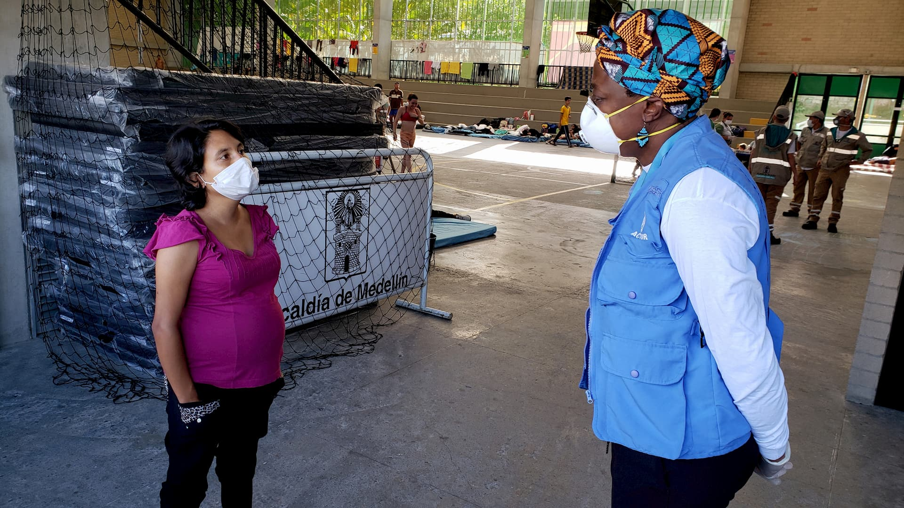
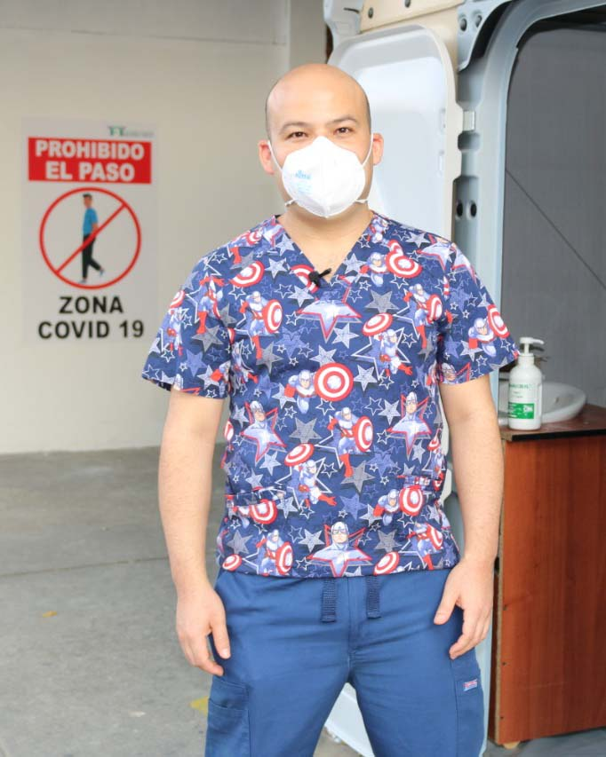

---
# Front cover title and subtitle. Also use in the running header thoughout the document
title: "Beautiful"
subtitle: "Branded Report"
# Abstract create an introduction box on the cover. Should be concise.
#If you want want a full page image just remove abstract-title and abstract from the YAML
abstract-title: My really important intro
abstract: "Tur, sequis sunt abor rempos molupiet lab ipsa natque con niminve llesequos derro restes serionet autasperit ut estrum, ut quia excero et vit voloreic torum quae erias earchil explique pe officabo"
# Date is used in the running footer
date: "5 March 2021"
# Author are the persons creating the doc. They won't appear in the doc but will be part of the DOM.
# For the contact on the back cover, please refer to the bottom of the Rmd and ammend accordingly.
author:
  - name: Cedric Vidonne
    affiliation: IMO
    email: <vidonne@unhcr.org>
  - name: Contact name2
    affiliation: Job title2
    email: <contact2email@unhcr.org>
output:
  unhcrthemes::unhcr_paged:
    css: ["unhcr-generic-fonts.css", "unhcr-generic-page.css", "unhcr-generic.css"]
    # Change to point to your cover file
    front_cover: img/col_cover.jpg
    # Keep as is it includes back cover UNHCR blue background and logo
    back_cover: unhcr-backcover.svg
    # Change to false to remove table of content
    toc: true
    # Change to true to add number in front of chapters
    number_sections: false
    # Change to true for a self-contained document, but it'll be a litte slower for Pandoc to render
    self_contained: false
# Set  toc title, default none
toc-title: Contents
# Change to false to remove list of tables
lot: false
# Set lot title, default: "List of Tables"
lot-title: "Tables"
# Change to false to remove list of figures
lof: false
# Set lof title, default: "List of Figures"
lof-title: "Figures"
# If you include any <abbr> a list of abbreviations will be built.
# Set lof title, default: "List of Abbreviations"
loa-title: "Acronyms"
# Include footnotes direclty in the related page
paged-footnotes: true
# Turn links to footnote when printing the PDF on/off
links-to-footnotes: true
# uncomment this line to produce HTML and PDF in RStudio:
#knit: pagedown::chrome_print
---

```{r setup, include=FALSE}
knitr::opts_chunk$set(
  echo = TRUE,
  dev = "ragg_png",
  fig.width = 5.5,
  fig.height = 4,
  fig.align = "center")
```

```{r packages, include=FALSE, message=FALSE, warning=FALSE}
# Load required packages for charts with UNHCR style 
library(unhcrthemes)
library(unhcRstyle)
library(unhcrdatapackage)
library(tidyverse)
library(showtext)

# syntax: font_add(family = "<family_name>", regular = "/path/to/font/file")
font.add("Lato", regular = "Lato-Regular.ttf",  bold = "Lato-Bold.ttf", italic = "Lato-Italic.ttf")
# automatically use showtexts for new devices
showtext::showtext_auto()

popdata <- unhcrdatapackage::end_year_population_totals

```

# Methodology

::: {.lead .unhcr-grey}
Lorem ipsum dolor sit amet, **consectetur adipiscing elit**. In odio eros, viverra et lacus ac, scelerisque pretium urna. Proin scelerisque posuere eros sed finibus.
:::

Lorem ipsum dolor sit amet, consectetur adipiscing elit. In odio eros, viverra et lacus ac, scelerisque pretium urna. Proin scelerisque posuere eros sed finibus. Phasellus non risus quis mi aliquet aliquam sit amet vitae est. Nullam vitae purus interdum, faucibus felis in, dictum massa. Ut ornare risus at ex *condimentum* facilisis. Pellentesque facilisis libero eu ipsum sollicitudin venenatis eget sed sem. Quisque quis vehicula tellus, ac porta sem. Cras orci lectus, fringilla congue vulputate vel, aliquam eu sem. Nulla facilisi. Nulla sit amet enim non mi condimentum pharetra et sed neque. Nullam convallis mauris vel neque hendrerit ullamcorper.

## Heading 2

Duis ac turpis ut mi tristique consequat. Ut posuere feugiat lacus ac cursus. Integer blandit sem vel diam pretium, vel lobortis nunc vulputate. Proin faucibus venenatis ligula, quis varius ex laoreet in. Vestibulum et interdum enim, ut tempus tellus. Donec id iaculis eros. Pellentesque eget tempor ipsum. Aenean ac hendrerit arcu. Vestibulum porttitor aliquam risus **posuere convallis**. Sed ligula nisl, dapibus vel metus ac, molestie semper justo. Donec vel nisi nec dolor auctor venenatis. Sed ultricies dignissim auctor. Donec tincidunt quis mi eu tristique. Aliquam tristique maximus consequat.

Maecenas tincidunt quis tellus ac feugiat. Nulla mi felis, convallis quis neque ac, volutpat fringilla risus. Cras condimentum egestas volutpat. **[Praesent gravida semper lectus eu sagittis.]{.unhcr-blue}** Phasellus tristique felis nec finibus iaculis. Maecenas ex justo, tristique vitae orci nec, pellentesque fringilla turpis. Morbi molestie sollicitudin enim, a aliquam purus iaculis in. Nunc iaculis metus ac lobortis consequat. Phasellus tempus varius molestie. Curabitur nec ultrices ligula. Nulla sed ex nulla.

:::{.img75}

*Visit of shelter site. &copy; Best Photographer*

:::

## Heading 2

:::{.bg-grey}
Nunc eget suscipit metus. Interdum et malesuada fames ac ante ipsum primis in faucibus. Etiam in pulvinar nisi. Phasellus ullamcorper, lectus in egestas venenatis, turpis metus vulputate ex, cursus aliquam augue elit quis dui. Proin tellus elit, scelerisque sit amet tempus at, convallis sed lorem. Suspendisse hendrerit eleifend massa, ut congue augue viverra vel. Sed vel rhoncus neque. Etiam quis turpis nisi. Mauris nec sapien tellus. Etiam lectus tellus, posuere vel placerat eget, aliquam ut arcu. Aliquam eu velit sit amet magna facilisis maximus eget sit amet massa. Donec pretium ullamcorper mattis. Donec viverra nibh eu venenatis tempus. Mauris non malesuada velit.
:::

Suspendisse ut ex arcu. Nulla quis nunc egestas ipsum congue hendrerit. Nullam id ligula in erat lacinia porta. Nulla placerat mauris nec <u>felis lobortis blandit et quis elit</u>. Pellentesque eget ullamcorper nibh. Vestibulum ante ipsum primis in faucibus orci luctus et ultrices posuere cubilia curae; Aenean et neque urna. Phasellus malesuada nunc eget vehicula fermentum.

> Complete quote should include 3 ">" on 3 seperate lines
>
> Cedric Vidonne

Nunc eget suscipit UNHCR^[The UN Refugee Agency]. Interdum et malesuada fames ac ante ipsum primis in faucibus. Etiam in pulvinar nisi. Phasellus ullamcorper, lectus in egestas venenatis, turpis metus vulputate ex, cursus aliquam augue elit quis dui. Proin tellus elit, scelerisque sit amet tempus at, convallis sed lorem. Suspendisse hendrerit eleifend massa, ut congue augue viverra vel.

#### Heading 4

- I'm the first item of a list
- I'm the second item of this list
    1. I can be mixed with ordered list
    2. And even nested
- The last point of the list

Suspendisse ut ex arcu. Nulla quis nunc egestas ipsum congue hendrerit. Nullam id ligula in erat lacinia porta. Nulla placerat mauris nec <u>felis lobortis blandit et quis elit</u>. Pellentesque eget ullamcorper nibh. Vestibulum ante ipsum primis in faucibus orci luctus et ultrices posuere cubilia curae; Aenean et neque urna. Phasellus malesuada nunc eget vehicula fermentum.

# Heading 1 will go to a new page

::: {.lead .unhcr-grey}
Lorem ipsum dolor sit amet, **consectetur adipiscing elit**. In odio eros, viverra et lacus ac, scelerisque pretium urna. Proin scelerisque posuere eros sed finibus.
:::

<abbr title="UNHCR, The UN Refugee Agency">UNHCR</abbr> ipsum dolor sit amet, consectetur adipiscing elit. In odio eros, viverra et lacus ac, scelerisque pretium urna. Proin scelerisque posuere eros sed finibus. Phasellus non risus quis mi aliquet aliquam sit amet vitae est. Nullam vitae purus interdum, faucibus felis in, dictum massa. Ut ornare risus at ex *condimentum* facilisis. Pellentesque facilisis libero eu ipsum sollicitudin venenatis eget sed sem. Quisque quis vehicula tellus, ac porta sem. Cras orci lectus, fringilla congue vulputate vel, aliquam eu sem. Nulla facilisi. Nulla sit amet enim non mi condimentum pharetra et sed neque. Nullam convallis mauris vel neque hendrerit ullamcorper.

## Heading 2

:::{.clearfix}
:::{.img50 .float-end}

:::
Duis ac turpis ut mi tristique consequat. Ut posuere feugiat lacus ac cursus. Integer blandit sem vel diam pretium, vel lobortis nunc vulputate. Proin faucibus venenatis ligula, quis varius ex laoreet in. Vestibulum et interdum enim, ut tempus tellus. Donec id iaculis eros. Pellentesque eget tempor ipsum. Aenean ac hendrerit arcu. Vestibulum porttitor aliquam risus **posuere convallis**. Sed ligula nisl, dapibus vel metus ac, molestie semper justo. Donec vel nisi nec dolor auctor venenatis. Sed ultricies dignissim auctor. Donec tincidunt quis mi eu tristique. Aliquam tristique maximus consequat.

##### Heading 5

- Maecenas tincidunt quis tellus ac feugiat. Nulla mi felis, convallis quis neque ac, volutpat fringilla risus. Cras condimentum egestas volutpat. Praesent gravida semper lectus eu sagittis.
- Phasellus tristique felis nec finibus iaculis. Maecenas ex justo, tristique vitae orci nec, pellentesque fringilla turpis. Morbi molestie sollicitudin enim, a aliquam purus iaculis in.
- Nunc iaculis metus ac lobortis consequat. Phasellus tempus varius molestie. Curabitur nec ultrices ligula. Nulla sed ex nulla.
:::

### Heading 3

Nunc eget suscipit metus. Interdum et malesuada fames ac ante ipsum primis in faucibus. Etiam in pulvinar nisi. Phasellus ullamcorper, lectus in egestas venenatis, turpis metus vulputate ex, cursus aliquam augue elit quis dui. Proin tellus elit, scelerisque sit amet tempus at, convallis sed lorem. Suspendisse hendrerit eleifend massa, ut congue augue viverra vel. Sed vel rhoncus neque. Etiam quis turpis nisi. Mauris nec sapien tellus. Etiam lectus tellus, posuere vel placerat eget, aliquam ut arcu. Aliquam eu velit sit amet magna facilisis maximus eget sit amet massa. Donec pretium ullamcorper mattis. Donec viverra nibh eu venenatis tempus. Mauris non malesuada velit.

### Heading 3

Suspendisse ut ex arcu. Nulla quis nunc egestas ipsum congue hendrerit. Nullam id ligula in erat lacinia porta. Nulla placerat mauris nec <u>felis lobortis blandit et quis elit</u>. Pellentesque eget ullamcorper nibh. Vestibulum ante ipsum primis in faucibus orci luctus et ultrices posuere cubilia curae; Aenean et neque urna. Phasellus malesuada nunc eget vehicula fermentum.

## Heading 2

Duis ac turpis ut mi tristique consequat. Ut posuere feugiat lacus ac cursus. Integer blandit sem vel diam pretium, vel lobortis nunc vulputate. Proin faucibus venenatis ligula, quis varius ex laoreet in. Vestibulum et interdum enim, ut tempus tellus. Donec id iaculis eros. Pellentesque eget tempor ipsum. Aenean ac hendrerit arcu. Vestibulum porttitor aliquam risus **posuere convallis**. Sed ligula nisl, dapibus vel metus ac, molestie semper justo. Donec vel nisi nec dolor auctor venenatis. Sed ultricies dignissim auctor. Donec tincidunt quis mi eu tristique. Aliquam tristique maximus consequat.

##### Table of displaced population

Table are easily added with the `knitr::kable` function

```{r table-displaced, echo=FALSE, message=FALSE, warning=FALSE}
displaced_table <- popdata %>% 
  group_by(Year) %>% 
  summarise(Refugees = sum(REF, na.rm = TRUE),
            `IDPs` = sum(IDP, na.rm = TRUE),
            `Asylum-seekers` = sum(ASY, na.rm = TRUE),
            `Stateless` = sum(STA, na.rm = TRUE),
            `Other of concern` = sum(OOC, na.rm = TRUE),
            `Venezuelans displaced abroad` = sum(VDA, na.rm = TRUE)) %>% 
  arrange(desc(Year))
knitr::kable(head(displaced_table, 5),
             caption = "Displaced population for the last 5 years",
             format.args = list(big.mark = ",", scientific = FALSE))
```


## Heading 2

Duis ac turpis ut mi tristique consequat. Ut posuere feugiat lacus ac cursus. Integer blandit sem vel diam pretium, vel lobortis nunc vulputate. Proin faucibus venenatis ligula, quis varius ex laoreet in. Vestibulum et interdum enim, ut tempus tellus. Donec id iaculis eros. Pellentesque eget tempor ipsum. Aenean ac hendrerit arcu. Vestibulum porttitor aliquam risus **posuere convallis**. Sed ligula nisl, dapibus vel metus ac, molestie semper justo. Donec vel nisi nec dolor auctor venenatis. Sed ultricies dignissim auctor. Donec tincidunt quis mi eu tristique. Aliquam tristique maximus consequat.

Duis ac turpis ut mi tristique consequat. Ut posuere feugiat lacus ac cursus. Integer blandit sem vel diam pretium, vel lobortis nunc vulputate. Proin faucibus venenatis ligula, quis varius ex laoreet in. Vestibulum et interdum enim, ut tempus tellus. Donec id iaculis eros. Pellentesque eget tempor ipsum. Aenean ac hendrerit arcu. Vestibulum porttitor aliquam risus **posuere convallis**. Sed ligula nisl, dapibus vel metus ac, molestie semper justo. Donec vel nisi nec dolor auctor venenatis. Sed ultricies dignissim auctor. Donec tincidunt quis mi eu tristique. Aliquam tristique maximus consequat.

##### Table of displaced population striped

With the help of helper function we can change the look of the table.


:::{.table-striped}
```{r table-striped, echo=FALSE, message=FALSE, warning=FALSE}
displaced_table <- popdata %>% 
  group_by(Year) %>% 
  summarise(Refugees = sum(REF, na.rm = TRUE),
            `IDPs` = sum(IDP, na.rm = TRUE),
            `Asylum-seekers` = sum(ASY, na.rm = TRUE),
            `Stateless` = sum(STA, na.rm = TRUE),
            `Other of concern` = sum(OOC, na.rm = TRUE),
            `Venezuelans displaced abroad` = sum(VDA, na.rm = TRUE)) %>% 
  arrange(desc(Year))
knitr::kable(head(displaced_table, 5),
             caption = "Displaced population for the last 5 years",
             format.args = list(big.mark = ",", scientific = FALSE))
```
:::

# Heading 1 will go to a new page

::: {.lead .unhcr-grey}
Lorem ipsum dolor sit amet, **consectetur adipiscing elit**. In odio eros, viverra et lacus ac, scelerisque pretium urna. Proin scelerisque posuere eros sed finibus.
:::

## Plots

<abbr title="UNHCR, The UN Refugee Agency">UNHCR</abbr> ipsum dolor sit amet, consectetur adipiscing elit. In odio eros, viverra et lacus ac, scelerisque pretium urna. Proin scelerisque posuere eros sed finibus. Phasellus non risus quis mi aliquet aliquam sit amet vitae est. Nullam vitae purus interdum, faucibus felis in, dictum massa. Ut ornare risus at ex *condimentum* facilisis. Pellentesque facilisis libero eu ipsum sollicitudin venenatis eget sed sem. Quisque quis vehicula tellus, ac porta sem. Cras orci lectus, fringilla congue vulputate vel, aliquam eu sem. Nulla facilisi. Nulla sit amet enim non mi condimentum pharetra et sed neque. Nullam convallis mauris vel neque hendrerit ullamcorper.

```{r single-line, echo=FALSE, message=FALSE, fig.cap="Plot caption example"}
ggplot(datasets::iris, aes(x = Petal.Length, y = Petal.Width)) +
  geom_point(color = unhcr_blue) +
  labs(x="Petal length", y="Petal width",
      title = "Iris data ggplot2 scatterplot example",
      subtitle= "Just a simple plot to show the basic style of theme_unhcr",
      caption = "Data from datasets::iris") +
  unhcr_theme(base_size = 14)
```

:::{.page-break}
:::

## R Markdown

This is an R Markdown document. Markdown is a simple formatting syntax for authoring HTML, PDF, and MS Word documents. For more details on using R Markdown see <http://rmarkdown.rstudio.com>.

When you click the **Knit** button a document will be generated that includes both content as well as the output of any embedded R code chunks within the document. You can embed an R code chunk like this:

## Even code

When you compile an R Markdown document to HTML in RStudio, RStudio will display the HTML page through a local web server, so paged.js will work in RStudio Viewer. However, when you view such pages in a real web browser, you will need a separate web server. The easiest way to preview these HTML pages in a web browser may be through the RStudio **servr** package, just type the following code in your R console and head to <http://127.0.0.1:4321/> in your browser to access the files.

```{r servr, include=TRUE, eval=FALSE}
# Load webserver to preview paged HTML 
servr::httd()
```

## Tables

You can also embed tables. The easiest way is to use the `kable` function from the `knitr` package, that is included in the code chunks of your Rmd file. UNHCR styles are applied by default to the tables.

**Example:**

```{r table-simple, echo=FALSE, message=FALSE, warning=FALSE}
knitr::kable(head(datasets::iris, 5),
             caption = "Table caption example")
```

::: {.back-cover}

::: {.back-header}
<h1 class="back-title"></h1>
<h1 class="back-subtitle"></h1>
:::

::: {.back-footer}
For more information please contact:

::: {.back-contact}
[Cedric Vidonne]{.back-name}

IMO

[vidonne@unhcr.org](mailto:vidonne@unhcr.org)
:::

::: 


:::
