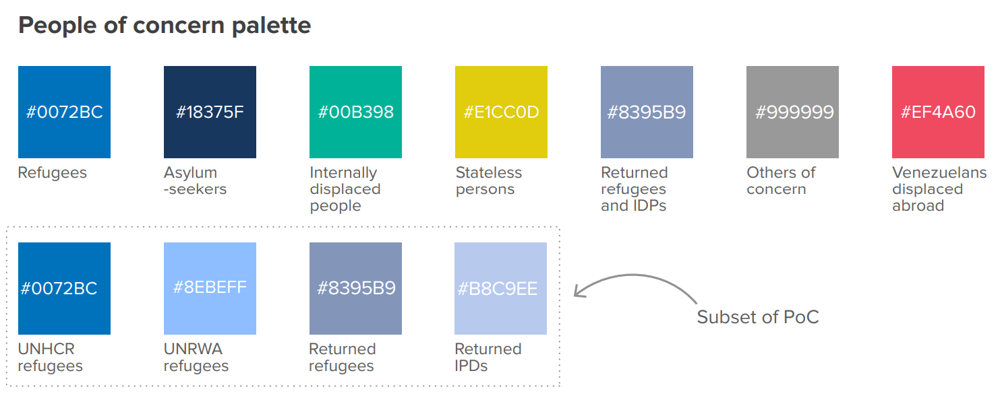

```{r setup, include=FALSE}
options(htmltools.dir.version = FALSE)
library(ragg)
knitr::opts_chunk$set(
  message = FALSE,
  warning = FALSE,
  collapse = TRUE,
  comment = "#",
  dev = "ragg_png",
  fig.showtext = TRUE,
  fig.retina = 2,
  dpi = 300
)
library(tidyverse)
library(unhcrthemes)
displ <- read_csv("data/displaced_pop.csv")
displ <- displ |> 
  mutate(pop = factor(pop,
                      levels = c("Latest available estimates", "Venezuelans displaced abroad", "Asylum seekers", "Refugees under UNRWA’s mandate",
                                 "Refugees under UNHCR's mandate", "IDPs")))
```

```{css, echo = FALSE}
.primary {
  color: var(--unhcr-blue);
}
.w-75 {
  max-width: 75%;
}
.w-50 {
  max-width: 50%;
}
.w-25 {
  max-width: 25%;
}

.table {
  font-size: 18px;
}
```

## Objectives

.pull-left[

**About today:**

- Basic of the grammar of graphics and [**`ggplot2`**](https://ggplot2.tidyverse.org/index.html)

- Introduction to the [**`unhcrthemes`**](https://vidonne.github.io/unhcrthemes/) package

- Best practices to create **UNHCR branded** visuals in R, with examples

- What else, dynamic report with the [**`unhcrdown`**](https://github.com/vidonne/unhcrdown)

]

--

.pull-right[

**Not today:**

- Data import: [`readr`](https://readr.tidyverse.org/), [`readxl`](https://readxl.tidyverse.org/), etc.

- Data manipulation: [`dplyr`](https://dplyr.tidyverse.org/), [`tidyr`](https://tidyr.tidyverse.org/), etc.

- R programming: [R for Data Science](https://r4ds.had.co.nz/), [Advanced R Programming](https://adv-r.hadley.nz/), etc.

]

---
class: inverse, center, middle

# `ggplot2` and `unhcrthemes`

### Introduction

---

## The `ggplot2` package

.pull-left[

- **`ggplot2`** is an R package for declaratively creating graphics

- **`ggplot2`** is an implementation [The Grammar of Graphics](https://link.springer.com/chapter/10.1007/978-3-642-21551-3_13) by Leland Irving

- **The idea** don't start with the final form of the graphic (Excel approach) but **decompose the graphic** into its constituents

]

.pull-right[

.center[]

]


???
You provide the data, tell ggplot2 how to map variables to aesthetics, what graphical primitives to use, and it takes care of the details.
What does it take to create a graphic? Data, axis, geometric objects, etc.

---

## Structure of `ggplot2`

How a **`ggplot2`** graph is built on the grammar of graphics elements:

```{r, echo=FALSE}
ggplot <- read_csv("data/ggplot.csv")
kableExtra::kbl(head(ggplot, 1), format = 'html') |> 
  kableExtra::kable_styling(font_size = 16) |> 
  kableExtra::column_spec(1, bold = TRUE) |> 
  kableExtra::column_spec(2, bold = TRUE, color = "#0072bc")

```

???
1. Data - without data, you don't have a plot!
2. Mapping - linking variables to graphical properties.
3. Geometries - interpret aesthetics as graphical representations.
4. Statistics - compute/transform numbers for us.
5. Scales - interpret values in data to graphical properties.
6. Coordinates - define physical mapping.
7. Facets - split plot into panels.
8. Theme - what does your plot look like?

---

## Structure of `ggplot2`

How a **`ggplot2`** graph is built on the grammar of graphics elements:

```{r, echo=FALSE}
ggplot <- read_csv("data/ggplot.csv")
kableExtra::kbl(head(ggplot, 2), format = 'html') |> 
  kableExtra::kable_styling(font_size = 16) |> 
  kableExtra::column_spec(1, bold = TRUE) |> 
  kableExtra::column_spec(2, bold = TRUE, color = "#0072bc")

```

???
1. Data - without data, you don't have a plot!
2. Mapping - linking variables to graphical properties.
3. Geometries - interpret aesthetics as graphical representations.
4. Statistics - compute/transform numbers for us.
5. Scales - interpret values in data to graphical properties.
6. Coordinates - define physical mapping.
7. Facets - split plot into panels.
8. Theme - what does your plot look like?

---

## Structure of `ggplot2`

How a **`ggplot2`** graph is built on the grammar of graphics elements:

```{r, echo=FALSE}
ggplot <- read_csv("data/ggplot.csv")
kableExtra::kbl(head(ggplot, 3), format = 'html') |> 
  kableExtra::kable_styling(font_size = 16) |> 
  kableExtra::column_spec(1, bold = TRUE) |> 
  kableExtra::column_spec(2, bold = TRUE, color = "#0072bc")

```

???
1. Data - without data, you don't have a plot!
2. Mapping - linking variables to graphical properties.
3. Geometries - interpret aesthetics as graphical representations.
4. Statistics - compute/transform numbers for us.
5. Scales - interpret values in data to graphical properties.
6. Coordinates - define physical mapping.
7. Facets - split plot into panels.
8. Theme - what does your plot look like?

---

## Structure of `ggplot2`

How a **`ggplot2`** graph is built on the grammar of graphics elements:

```{r, echo=FALSE}
ggplot <- read_csv("data/ggplot.csv")
kableExtra::kbl(head(ggplot, 4), format = 'html') |> 
  kableExtra::kable_styling(font_size = 16) |> 
  kableExtra::column_spec(1, bold = TRUE) |> 
  kableExtra::column_spec(2, bold = TRUE, color = "#0072bc")

```

???
1. Data - without data, you don't have a plot!
2. Mapping - linking variables to graphical properties.
3. Geometries - interpret aesthetics as graphical representations.
4. Statistics - compute/transform numbers for us.
5. Scales - interpret values in data to graphical properties.
6. Coordinates - define physical mapping.
7. Facets - split plot into panels.
8. Theme - what does your plot look like?

---

## Structure of `ggplot2`

How a **`ggplot2`** graph is built on the grammar of graphics elements:

```{r, echo=FALSE}
ggplot <- read_csv("data/ggplot.csv")
kableExtra::kbl(head(ggplot, 5), format = 'html') |> 
  kableExtra::kable_styling(font_size = 16) |> 
  kableExtra::column_spec(1, bold = TRUE) |> 
  kableExtra::column_spec(2, bold = TRUE, color = "#0072bc")

```

???
1. Data - without data, you don't have a plot!
2. Mapping - linking variables to graphical properties.
3. Geometries - interpret aesthetics as graphical representations.
4. Statistics - compute/transform numbers for us.
5. Scales - interpret values in data to graphical properties.
6. Coordinates - define physical mapping.
7. Facets - split plot into panels.
8. Theme - what does your plot look like?

---

## Structure of `ggplot2`

How a **`ggplot2`** graph is built on the grammar of graphics elements:

```{r, echo=FALSE}
ggplot <- read_csv("data/ggplot.csv")
kableExtra::kbl(head(ggplot, 6), format = 'html') |> 
  kableExtra::kable_styling(font_size = 16) |> 
  kableExtra::column_spec(1, bold = TRUE) |> 
  kableExtra::column_spec(2, bold = TRUE, color = "#0072bc")

```

???
1. Data - without data, you don't have a plot!
2. Mapping - linking variables to graphical properties.
3. Geometries - interpret aesthetics as graphical representations.
4. Statistics - compute/transform numbers for us.
5. Scales - interpret values in data to graphical properties.
6. Coordinates - define physical mapping.
7. Facets - split plot into panels.
8. Theme - what does your plot look like?

---

## Structure of `ggplot2`

How a **`ggplot2`** graph is built on the grammar of graphics elements:

```{r, echo=FALSE}
ggplot <- read_csv("data/ggplot.csv")
kableExtra::kbl(head(ggplot, 7), format = 'html') |> 
  kableExtra::kable_styling(font_size = 16) |> 
  kableExtra::column_spec(1, bold = TRUE) |> 
  kableExtra::column_spec(2, bold = TRUE, color = "#0072bc")

```

???
1. Data - without data, you don't have a plot!
2. Mapping - linking variables to graphical properties.
3. Geometries - interpret aesthetics as graphical representations.
4. Statistics - compute/transform numbers for us.
5. Scales - interpret values in data to graphical properties.
6. Coordinates - define physical mapping.
7. Facets - split plot into panels.
8. Theme - what does your plot look like?

---

## Structure of `ggplot2`

How a **`ggplot2`** graph is built on the grammar of graphics elements:

```{r, echo=FALSE}
ggplot <- read_csv("data/ggplot.csv")
kableExtra::kbl(head(ggplot, 8), format = 'html', caption = "Credit: Cedric Scherer") |> 
  kableExtra::kable_styling(font_size = 16) |> 
  kableExtra::column_spec(1, bold = TRUE) |> 
  kableExtra::column_spec(2, bold = TRUE, color = "#0072bc")

```

???
1. Data - without data, you don't have a plot!
2. Mapping - linking variables to graphical properties.
3. Geometries - interpret aesthetics as graphical representations.
4. Statistics - compute/transform numbers for us.
5. Scales - interpret values in data to graphical properties.
6. Coordinates - define physical mapping.
7. Facets - split plot into panels.
8. Theme - what does your plot look like?

---

## `unhcrthemes` package

.pull-left[

1. **Branded** `ggplot2` theme

]

.pull-right[

```{r, echo=FALSE, fig.height=5}
data(idp, package = "unhcrthemes")

idp_total <- idp |>
  group_by(year) |>
  summarise(idp = sum(idp, na.rm = TRUE) / 1e6) |>
  ungroup()

ggplot(idp_total) +
  geom_col(aes(x = year, y = idp),
           fill = unhcr_pal(n = 1, "pal_blue"),
           width = 0.8) +
  labs(title = "Globalement IDP displacement | 2010 - 2020",
       y = "Number of people (in million)",
       caption = "Source: UNHCR Refugee Data Finder\n© UNHCR, The UN Refugee Agency") +
  scale_y_continuous(expand = expansion(c(0, 0.1))) +
  scale_x_continuous(breaks = scales::pretty_breaks(10)) +
  theme_unhcr(grid = "Y", axis_title = "y")

```

]

---

## `unhcrthemes` package

.pull-left[

1. **Branded** `ggplot2` theme

2. A series of color palette for:

    - A **categorical palette** for UNHCR main data visualization colors

    - A **categorical palette** for people of concern to UNHCR categories

    - A **categorical palette** for geographical regional divisions of UNHCR

    - Six **sequential color palettes** for all the main data visualization colors

    - Two recommended **diverging color palette**

]

.pull-right[


```{r, echo=FALSE,fig.height=4.5}
display_unhcr_all()
```

]

---

## `unhcrthemes` package

.pull-left[

1. **Branded** `ggplot2` theme

2. A series of color palette for:

    - A **categorical palette** for UNHCR main data visualization colors

    - A **categorical palette** for people of concern to UNHCR categories

    - A **categorical palette** for geographical regional divisions of UNHCR

    - Six **sequential color palettes** for all the main data visualization colors

    - Two recommended **diverging color palette**
    
3. Available on [github](https://github.com/vidonne/unhcrthemes/), dedicated [documentation page](https://vidonne.github.io/unhcrthemes/index.html) and throughout [examples of the data visualization platform](https://dataviz.unhcr.org/tools/r/).

]

.pull-right[

.center[]

]


---
class: inverse, center, middle

# `ggplot2` and `unhcrthemes`

### In action


---

## Aim

.pull-left[

Replicate a chart example from the [Global Trends 2021](https://www.unhcr.org/globaltrends.html) webpage, using `ggplot2` and make it brand compliant with `unhcrthemes` packages.


]

.pull-right[


```{r, echo=FALSE, fig.height=6}
ggplot(data = displ,
       aes(x = year, y = num,
           fill = pop, group = pop)) +
  geom_col() +
  scale_x_continuous(breaks = scales::pretty_breaks(n = 10)) +
  scale_y_continuous(labels = scales::label_number_si(),
                     expand = expansion(c(0, 0.1))) +
  scale_fill_unhcr_d(guide=guide_legend(reverse = TRUE), direction = -1,
                     palette = "pal_unhcr_poc",
                     nmax = 9, order = c(4, 1:3, 9, 8)) +
  labs(title = "People forced to flee worldwide | 2012-2022",
    caption = "Source: UNHCR Refugee Data Finder") +
  theme_unhcr(grid = "Y",
              axis_title = FALSE)
```

]

---

## Setup

.pull-left[


```{r, eval=FALSE}
# Install packages 
# if needed uncomment lines below
# install.packages('tidyverse')
# remotes::install_github("vidonne/unhcrthemes") 

# Load packages
library(tidyverse)
library(unhcrthemes)

# Load data
displ <- read_csv("data/displaced_pop.csv")

# Check data structure
View(displ)
```

]

.pull-right[


```{r, echo=FALSE}
knitr::kable(head(displ), format = 'html', col.names = c("Year", "Population type", "# of people"))
```

]

---

## Data

.pull-left[

```{r, eval=FALSE}
ggplot(data = displ) #<<
```

]

.pull-right[

```{r, echo=FALSE, fig.height=6}
ggplot(data = displ)
```

]

???
1. Data - without data, you don't have a plot!
But nothing happens here because we haven't mapped the raw data to anything. SO we just get a empty canvas.

---

## Aesthetics

.pull-left[

```{r, eval=FALSE}
ggplot(data = displ,
       aes(x = year, y = num))  #<<
```

]

.pull-right[

```{r, echo=FALSE, fig.height=6}
ggplot(data = displ,
       aes(
         x = year,
         y = num
       ))
```

]

???
2. Mapping - linking variables to graphical properties.
We have now mapped the year to the x axis and the number displaced to y but we still don't see anything special except the axis value

---

## Geoms

.pull-left[

```{r, eval=FALSE}
ggplot(data = displ,
       aes(x = year, y = num)) +
  geom_col() #<<
```

]

.pull-right[

```{r, echo=FALSE, fig.height=6}
ggplot(data = displ,
       aes(x = year, y = num)) +
  geom_col()
```

]

---

## Scale

.pull-left[

```{r, eval=FALSE}
ggplot(data = displ,
       aes(x = year, y = num)) +
  geom_col() +
  scale_x_continuous( #<<
    breaks = scales::pretty_breaks(n = 10)) #<<
```

]

.pull-right[

```{r, echo=FALSE, fig.height=6}
ggplot(data = displ,
       aes(x = year, y = num)) +
  geom_col() +
  scale_x_continuous(breaks = scales::pretty_breaks(n = 10))
```

]

---

## Scale

.pull-left[

```{r, eval=FALSE}
ggplot(data = displ,
       aes(x = year, y = num)) +
  geom_col() +
  scale_x_continuous(
    breaks = scales::pretty_breaks(n = 10)) +
  scale_y_continuous( #<<
    labels = scales::label_number_si(), #<<
    expand = expansion(c(0, 0.1))) #<<
```

]

.pull-right[

```{r, echo=FALSE, fig.height=6}
ggplot(data = displ,
       aes(x = year, y = num)) +
  geom_col() +
  scale_x_continuous(breaks = scales::pretty_breaks(n = 10)) +
  scale_y_continuous(labels = scales::label_number_si(),
                     expand = expansion(c(0, 0.1)))
```

]

---

## Context

.pull-left[

Before playing with `unhcthemes` let's add some information on the chart.

```{r, eval=FALSE}
ggplot(data = displ,
       aes(x = year, y = num)) +
  geom_col() +
  scale_x_continuous(
    breaks = scales::pretty_breaks(n = 10)) +
  scale_y_continuous(
    labels = scales::label_number_si(), 
    expand = expansion(c(0, 0.1))) +
  labs(title = "People forced to flee worldwide | 2012-2022", #<<
    caption = "Source: UNHCR Refugee Data Finder") #<<
```

]

.pull-right[

```{r, echo=FALSE, fig.height=6}
ggplot(data = displ,
       aes(x = year, y = num)) +
  geom_col() +
  scale_x_continuous(breaks = scales::pretty_breaks(n = 10)) +
  scale_y_continuous(labels = scales::label_number_si(),
                     expand = expansion(c(0, 0.1))) +
  labs(title = "People forced to flee worldwide | 2012-2022",
    caption = "Source: UNHCR Refugee Data Finder")
```

]

---

## unhcrthemes

.pull-left[

```{r, eval=FALSE}
ggplot(data = displ,
       aes(x = year, y = num)) +
  geom_col() +
  scale_x_continuous(
    breaks = scales::pretty_breaks(n = 10)) +
  scale_y_continuous(
    labels = scales::label_number_si(), 
    expand = expansion(c(0, 0.1))) +
  labs(title = "People forced to flee worldwide | 2012-2022",
    caption = "Source: UNHCR Refugee Data Finder") +
  theme_unhcr() #<<
```

]

.pull-right[

```{r, echo=FALSE, fig.height=6}
ggplot(data = displ,
       aes(x = year, y = num)) +
  geom_col() +
  scale_x_continuous(breaks = scales::pretty_breaks(n = 10)) +
  scale_y_continuous(labels = scales::label_number_si(),
                     expand = expansion(c(0, 0.1))) +
  labs(title = "People forced to flee worldwide | 2012-2022",
    caption = "Source: UNHCR Refugee Data Finder") +
  theme_unhcr()
```

]

---

## unhcrthemes

.pull-left[

```{r, eval=FALSE}
ggplot(data = displ,
       aes(x = year, y = num)) +
  geom_col() +
  scale_x_continuous(
    breaks = scales::pretty_breaks(n = 10)) +
  scale_y_continuous(
    labels = scales::label_number_si(), 
    expand = expansion(c(0, 0.1))) +
  labs(title = "People forced to flee worldwide | 2012-2022",
    caption = "Source: UNHCR Refugee Data Finder") +
  theme_unhcr(grid = "Y", #<<
              axis_title = FALSE) #<<
```

]

.pull-right[

```{r, echo=FALSE, fig.height=6}
ggplot(data = displ,
       aes(x = year, y = num)) +
  geom_col() +
  scale_x_continuous(breaks = scales::pretty_breaks(n = 10)) +
  scale_y_continuous(labels = scales::label_number_si(),
                     expand = expansion(c(0, 0.1))) +
  labs(title = "People forced to flee worldwide | 2012-2022",
    caption = "Source: UNHCR Refugee Data Finder") +
  theme_unhcr(grid = "Y",
              axis_title = FALSE)
```

]

---

## unhcrthemes

.pull-left[

```{r, eval=FALSE}
ggplot(data = displ,
       aes(x = year, y = num)) +
  geom_col(
    color = unhcr_pal(n = 1, name = "pal_blue") #<<
    ) +
  scale_x_continuous(
    breaks = scales::pretty_breaks(n = 10)) +
  scale_y_continuous(
    labels = scales::label_number_si(), 
    expand = expansion(c(0, 0.1))) +
  labs(title = "People forced to flee worldwide | 2012-2022",
    caption = "Source: UNHCR Refugee Data Finder") +
  theme_unhcr(grid = "Y",
              axis_title = FALSE) 
```

]

--

.pull-right[

```{r, echo=FALSE, fig.height=6}
ggplot(data = displ,
       aes(x = year, y = num)) +
  geom_col(
    color = unhcr_pal(n = 1, name = "pal_blue")
  ) +
  scale_x_continuous(breaks = scales::pretty_breaks(n = 10)) +
  scale_y_continuous(labels = scales::label_number_si(),
                     expand = expansion(c(0, 0.1))) +
  labs(title = "People forced to flee worldwide | 2012-2022",
    caption = "Source: UNHCR Refugee Data Finder") +
  theme_unhcr(grid = "Y",
              axis_title = FALSE)
```

]

???
Is color the right property?
Also notice that we haven't mapped the color to anything but we're just setting it.

---

## unhcrthemes

.pull-left[

```{r, eval=FALSE}
ggplot(data = displ,
       aes(x = year, y = num)) +
  geom_col(
    fill = unhcr_pal(n = 1, name = "pal_blue") #<<
    ) +
  scale_x_continuous(
    breaks = scales::pretty_breaks(n = 10)) +
  scale_y_continuous(
    labels = scales::label_number_si(), 
    expand = expansion(c(0, 0.1))) +
  labs(title = "People forced to flee worldwide | 2012-2022",
    caption = "Source: UNHCR Refugee Data Finder") +
  theme_unhcr(grid = "Y",
              axis_title = FALSE) 
```

]

.pull-right[

```{r, echo=FALSE, fig.height=6}
ggplot(data = displ,
       aes(x = year, y = num)) +
  geom_col(
    fill = unhcr_pal(n = 1, name = "pal_blue")
  ) +
  scale_x_continuous(breaks = scales::pretty_breaks(n = 10)) +
  scale_y_continuous(labels = scales::label_number_si(),
                     expand = expansion(c(0, 0.1))) +
  labs(title = "People forced to flee worldwide | 2012-2022",
    caption = "Source: UNHCR Refugee Data Finder") +
  theme_unhcr(grid = "Y",
              axis_title = FALSE)
```

]

???
Is color the right property?
Also notice that we haven't mapped the color to anything but we're just setting it.

---

## unhcrthemes

.pull-left[

```{r, eval=FALSE}
ggplot(data = displ,
       aes(x = year, y = num,
           fill = pop)) + #<<
  geom_col() +
  scale_x_continuous(
    breaks = scales::pretty_breaks(n = 10)) +
  scale_y_continuous(
    labels = scales::label_number_si(), 
    expand = expansion(c(0, 0.1))) +
  labs(title = "People forced to flee worldwide | 2012-2022",
    caption = "Source: UNHCR Refugee Data Finder") +
  theme_unhcr(grid = "Y",
              axis_title = FALSE) 
```

]

.pull-right[

```{r, echo=FALSE, fig.height=6}
ggplot(data = displ,
       aes(x = year, y = num,
           fill = pop, group = pop)) +
  geom_col() +
  scale_x_continuous(breaks = scales::pretty_breaks(n = 10)) +
  scale_y_continuous(labels = scales::label_number_si(),
                     expand = expansion(c(0, 0.1))) +
  scale_fill_discrete(guide=guide_legend(reverse = TRUE)) +
  labs(title = "People forced to flee worldwide | 2012-2022",
    caption = "Source: UNHCR Refugee Data Finder") +
  theme_unhcr(grid = "Y",
              axis_title = FALSE)
```

]

---

## unhcrthemes

.pull-left[

```{r, eval=FALSE}
ggplot(data = displ,
       aes(x = year, y = num,
           fill = pop)) +
  geom_col() +
  scale_x_continuous(
    breaks = scales::pretty_breaks(n = 10)) +
  scale_y_continuous(
    labels = scales::label_number_si(), 
    expand = expansion(c(0, 0.1))) +
  scale_fill_unhcr_d() + #<<
  labs(title = "People forced to flee worldwide | 2012-2022",
    caption = "Source: UNHCR Refugee Data Finder") +
  theme_unhcr(grid = "Y",
              axis_title = FALSE) 
```

]

.pull-right[

```{r, echo=FALSE, fig.height=6}
ggplot(data = displ,
       aes(x = year, y = num,
           fill = pop, group = pop)) +
  geom_col() +
  scale_x_continuous(breaks = scales::pretty_breaks(n = 10)) +
  scale_y_continuous(labels = scales::label_number_si(),
                     expand = expansion(c(0, 0.1))) +
  scale_fill_unhcr_d(guide=guide_legend(reverse = TRUE), direction = -1) +
  labs(title = "People forced to flee worldwide | 2012-2022",
    caption = "Source: UNHCR Refugee Data Finder") +
  theme_unhcr(grid = "Y",
              axis_title = FALSE)
```

]

---

## unhcrthemes

.pull-left[

**Recommended colours from dataviz guideline**



]

.pull-right[

**Check available colours in the package**

```{r, fig.height=5}
display_unhcr_all()
```

]


---

## unhcrthemes

.pull-left[

```{r, eval=FALSE}
ggplot(data = displ,
       aes(x = year, y = num,
           fill = pop)) +
  geom_col() +
  scale_x_continuous(
    breaks = scales::pretty_breaks(n = 10)) +
  scale_y_continuous(
    labels = scales::label_number_si(), 
    expand = expansion(c(0, 0.1))) +
  scale_fill_unhcr_d(
    palette = "pal_unhcr_poc" #<<
  ) + 
  labs(title = "People forced to flee worldwide | 2012-2022",
    caption = "Source: UNHCR Refugee Data Finder") +
  theme_unhcr(grid = "Y",
              axis_title = FALSE) 
```

]

.pull-right[

```{r, echo=FALSE, fig.height=6}
ggplot(data = displ,
       aes(x = year, y = num,
           fill = pop, group = pop)) +
  geom_col() +
  scale_x_continuous(breaks = scales::pretty_breaks(n = 10)) +
  scale_y_continuous(labels = scales::label_number_si(),
                     expand = expansion(c(0, 0.1))) +
  scale_fill_unhcr_d(guide=guide_legend(reverse = TRUE), direction = -1,
                     palette = "pal_unhcr_poc") +
  labs(title = "People forced to flee worldwide | 2012-2022",
    caption = "Source: UNHCR Refugee Data Finder") +
  theme_unhcr(grid = "Y",
              axis_title = FALSE)
```

]

---

## unhcrthemes

.pull-left[

```{r, eval=FALSE}
ggplot(data = displ,
       aes(x = year, y = num,
           fill = pop)) +
  geom_col() +
  scale_x_continuous(
    breaks = scales::pretty_breaks(n = 10)) +
  scale_y_continuous(
    labels = scales::label_number_si(), 
    expand = expansion(c(0, 0.1))) +
  scale_fill_unhcr_d(
    palette = "pal_unhcr_poc",
    nmax = 9, order = c(4, 1:3, 9, 8) #<<
  ) + 
  labs(title = "People forced to flee worldwide | 2012-2022",
    caption = "Source: UNHCR Refugee Data Finder") +
  theme_unhcr(grid = "Y",
              axis_title = FALSE) 
```

]

.pull-right[

```{r, echo=FALSE, fig.height=6}
ggplot(data = displ,
       aes(x = year, y = num,
           fill = pop, group = pop)) +
  geom_col() +
  scale_x_continuous(breaks = scales::pretty_breaks(n = 10)) +
  scale_y_continuous(labels = scales::label_number_si(),
                     expand = expansion(c(0, 0.1))) +
  scale_fill_unhcr_d(guide=guide_legend(reverse = TRUE), direction = -1,
                     palette = "pal_unhcr_poc",
                     nmax = 9, order = c(4, 1:3, 9, 8)) +
  labs(title = "People forced to flee worldwide | 2012-2022",
    caption = "Source: UNHCR Refugee Data Finder") +
  theme_unhcr(grid = "Y",
              axis_title = FALSE)
```

]

---
class: inverse, center, middle

# UNHCR R packages

---

## unhcrdown

[unhcrdown](https://github.com/vidonne/unhcrdown) provides a set of templates following UNHCR Brand recommendations. The goal of this package is to ease and speed up the creation of reports, presentation and website while promoting the UNHCR visual identity.

.pull-left[

**Content**

1. Microsoft Word document
2. HTML to PDF paged reports
3. Microsoft PowerPoint presentation
4. HTML slides

]

.pull-right[


]

---

## Other UNHCR packages

* [unhcrdatapackage](https://github.com/Edouard-Legoupil/unhcrdatapackage): Use UNHCR Open data
* [hcrdata](https://github.com/UNHCR-WEB/hcrdata/): API to connect to internal data source
* [HighFrequencyChecks](https://github.com/unhcr/HighFrequencyChecks/): Perform High Frequency Check
* [koboloadeR](https://github.com/unhcr/koboloadeR/): Process data crunching for survey dataset
* [popdata](https://gitlab.com/dickoa/popdata): Download data from UNHCR POPDATA
* [ridl](https://gitlab.com/dickoa/ridl): R client to UNHCR Raw Internal Data Library


---
class: inverse, center, middle

# Thank you

### Questions?
